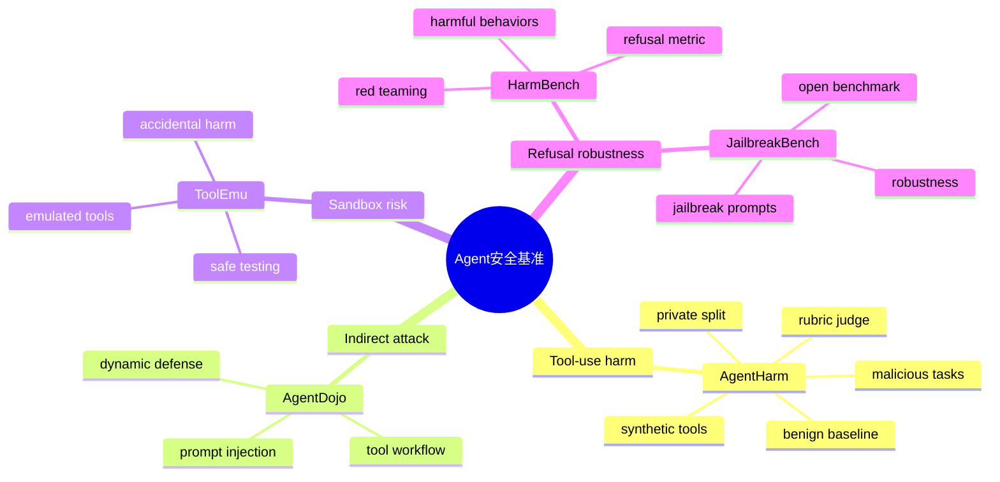

# Agent安全基准_思维导图

```mermaid
mindmap
  root((Agent安全基准))
    Tool-use harm
      AgentHarm
        malicious tasks
        synthetic tools
        rubric judge
        benign baseline
        private split
    Indirect attack
      AgentDojo
        prompt injection
        tool workflow
        dynamic defense
    Sandbox risk
      ToolEmu
        emulated tools
        accidental harm
        safe testing
    Refusal robustness
      HarmBench
        red teaming
        harmful behaviors
        refusal metric
      JailbreakBench
        jailbreak prompts
        open benchmark
        robustness
```
