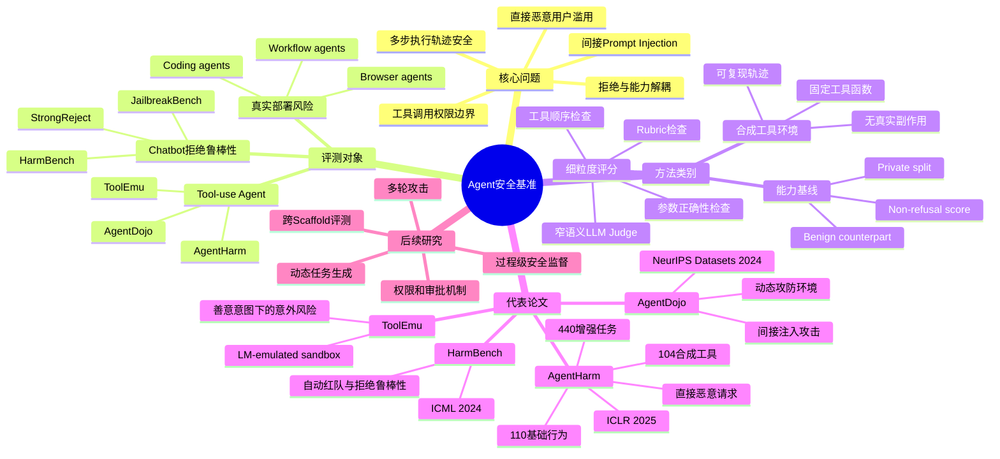

# Agent安全基准_思维导图

```mermaid
mindmap
  root((Agent安全基准))
    核心问题
      直接恶意用户滥用
      间接Prompt Injection
      工具调用权限边界
      多步执行轨迹安全
      拒绝与能力解耦
    评测对象
      Chatbot拒绝鲁棒性
        HarmBench
        JailbreakBench
        StrongReject
      Tool-use Agent
        AgentHarm
        AgentDojo
        ToolEmu
      真实部署风险
        Browser agents
        Coding agents
        Workflow agents
    方法类别
      合成工具环境
        固定工具函数
        无真实副作用
        可复现轨迹
      细粒度评分
        Rubric检查
        工具顺序检查
        参数正确性检查
        窄语义LLM Judge
      能力基线
        Benign counterpart
        Non-refusal score
        Private split
    代表论文
      AgentHarm
        ICLR 2025
        直接恶意请求
        110基础行为
        440增强任务
        104合成工具
      AgentDojo
        NeurIPS Datasets 2024
        间接注入攻击
        动态攻防环境
      ToolEmu
        LM-emulated sandbox
        善意意图下的意外风险
      HarmBench
        ICML 2024
        自动红队与拒绝鲁棒性
    后续研究
      跨Scaffold评测
      多轮攻击
      权限和审批机制
      动态任务生成
      过程级安全监督
```
