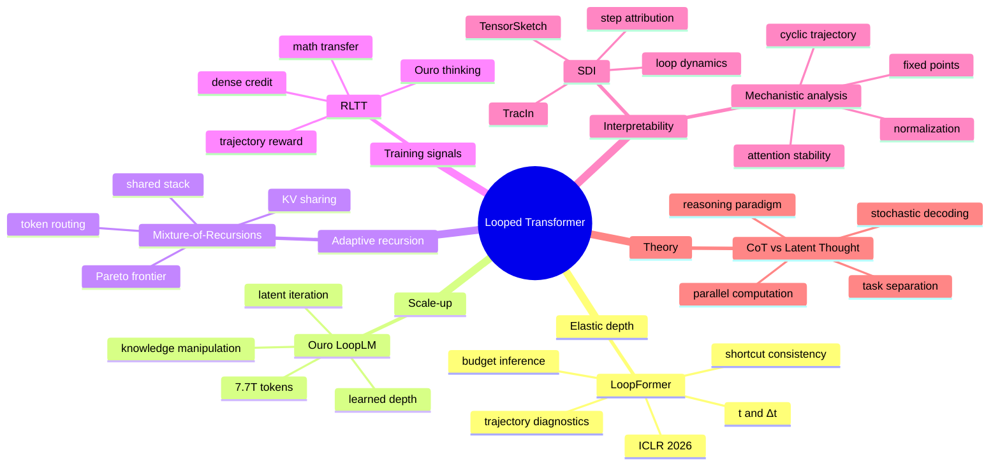

# Looped Transformer 思维导图

```mermaid
mindmap
  root((Looped Transformer))
    Elastic depth
      LoopFormer
        ICLR 2026
        budget inference
        t and Δt
        shortcut consistency
        trajectory diagnostics
    Scale-up
      Ouro LoopLM
        7.7T tokens
        latent iteration
        learned depth
        knowledge manipulation
    Adaptive recursion
      Mixture-of-Recursions
        token routing
        shared stack
        KV sharing
        Pareto frontier
    Training signals
      RLTT
        trajectory reward
        dense credit
        Ouro thinking
        math transfer
    Interpretability
      SDI
        step attribution
        TracIn
        TensorSketch
        loop dynamics
      Mechanistic analysis
        fixed points
        cyclic trajectory
        attention stability
        normalization
    Theory
      CoT vs Latent Thought
        parallel computation
        stochastic decoding
        task separation
        reasoning paradigm
```
