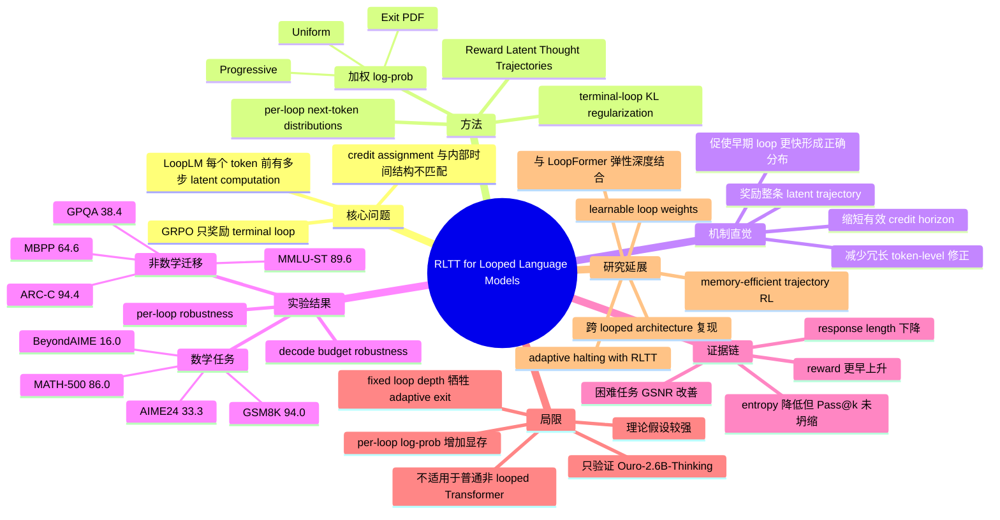

# Prioritize the Process, Not Just the Outcome: Rewarding Latent Thought Trajectories Improves Reasoning in Looped Language Models

## 基本信息

- **论文标题**：Prioritize the Process, Not Just the Outcome: Rewarding Latent Thought Trajectories Improves Reasoning in Looped Language Models
- **作者**：Jonathan Williams, Esin Tureci
- **机构**：Department of Computer Science, Princeton University
- **年份与版本**：arXiv 2026，v1 submitted 2026-02-11，v2 revised 2026-02-12；PDF 标注 Preprint. February 13, 2026
- **论文链接**：https://arxiv.org/abs/2602.10520
- **PDF**：https://arxiv.org/pdf/2602.10520
- **DOI**：https://doi.org/10.48550/arXiv.2602.10520
- **代码/项目页**：未在官方 arXiv 页面和快速检索中发现该 RLTT 论文的独立官方代码仓库
- **实验基座**：Ouro-2.6B-Thinking，来自 Ouro LoopLM 系列；Ouro 项目页为 https://ouro-llm.github.io/

## 一句话总结

RLTT 的核心贡献不是简单地把数学 RL benchmark 做高，而是指出 Looped Language Models 的强化学习 credit assignment 应该匹配其内部循环推理时间结构：既然模型在每个 token 前经过多个 latent loop 才形成最终分布，奖励就不应该只压到最后一个 loop，而应分配给整条 latent thought trajectory。

## 背景与问题动机

显式 Chain-of-Thought 通过输出更多 token 来换取推理能力，但会带来长推理、token 成本和“过度思考”问题。Looped Language Models 走的是另一条路线：在生成每个 token 前，模型重复应用共享权重的 Transformer block，在隐藏空间中进行多轮内部更新，然后只输出一个 token。这样可以把 test-time compute 放在 latent space 中，而不是完全展开为文字。

Ouro 这类 LoopLM 的直觉是：一个 token 的生成不是普通 Transformer 中的一次前向决策，而是一个内部迭代过程：

\[
h_j^{(1)} \rightarrow h_j^{(2)} \rightarrow \cdots \rightarrow h_j^{(T_{\max})}
\]

其中 \(j\) 是当前生成位置，\(t\) 是 loop index。每个 loop 的隐藏状态都可以通过同一个 LM head 映射为 next-token distribution：

\[
P_\theta^{(t)}(y_j \mid x, y_{<j})=\text{Softmax}(g(h_j^{(t)}))
\]

但实际采样通常只使用最后一个 loop 的分布：

\[
P_\theta^{(T_{\max})}(y_j \mid x, y_{<j})
\]

这就产生了本文的核心矛盾：LoopLM 的计算过程是多步 latent refinement，但标准 RLVR / GRPO 把每个 token 看成单步决策，只奖励最终 loop 的 log-prob。换言之，GRPO 的目标与 LoopLM 的内部结构错位了。

这也解释了为什么 Ouro 论文中提到标准 RL 没能给 LoopLM 带来显著增益：不是 RLVR 本身一定无效，而是 credit assignment 只作用于终点，无法直接塑造中间 latent thought distributions。

## 方法详解

### 1. 从 terminal-only GRPO 到 trajectory-level credit

标准 REINFORCE / GRPO 风格的梯度可以写成：

\[
\nabla_\theta J_{\text{standard}}(\theta)=
\mathbb{E}\left[
\frac{1}{g}\sum_{i=1}^{g}
\frac{1}{|y_i|}\sum_{j=1}^{|y_i|}
\nabla_\theta \log P_\theta^{(T_{\max})}(y_{i,j}\mid x,y_{i,<j})\hat A_i
\right]
\]

其中 \(g\) 是同一 prompt 下采样的 rollout 数量，\(\hat A_i\) 是 group-normalized advantage。这里真正被奖励直接作用的是终点分布 \(P_\theta^{(T_{\max})}\)。中间 loop 当然也会通过反向传播间接受到影响，但训练目标本身没有显式告诉模型：第 1、2、3 个 latent step 也应该朝正确答案轨迹收敛。

RLTT 做了一个非常直接的替换：把单个 terminal log-prob 换成所有 loops 的加权和：

\[
\nabla_\theta J_{\text{RLTT-PG}}(\theta)=
\mathbb{E}\left[
\frac{1}{g}\sum_{i=1}^{g}
\frac{1}{|y_i|}\sum_{j=1}^{|y_i|}
\sum_{t=1}^{T_{\max}}
\omega_t
\nabla_\theta \log P_\theta^{(t)}(y_{i,j}\mid x,y_{i,<j})\hat A_i
\right]
\]

其中：

\[
\omega_t \ge 0,\quad \sum_{t=1}^{T_{\max}}\omega_t=1
\]

这意味着如果某个 rollout 得到高 reward，那么不只是最后一个 loop 被鼓励产生该 token，整条 latent trajectory 上的每个 loop 都会按权重受到鼓励。反过来，如果 rollout 低质量，中间分布也会收到负向信号。

这不是外部 process reward，也不需要把中间 latent state 解码成文本后交给 verifier 打分。它利用的是 LoopLM 本来就可产生的 per-loop next-token distributions。

### 2. RLTT 的训练目标与 KL 正则

为保持语言建模能力，RLTT 仍加入 frozen reference policy 的 KL regularization。论文中的 KL 不是对所有中间 loop 做，而是基于 terminal-loop distribution：

\[
D_{\text{KL}}\left(
P_\theta^{(T_{\max})}(\cdot \mid x,y_{i,<j})
\Vert
P_{\text{ref}}^{(T_{\max})}(\cdot \mid x,y_{i,<j})
\right)
\]

最终目标可以理解为两部分：

1. **trajectory-weighted policy gradient**：用所有 loop 的 log-prob 参与 advantage 加权。
2. **terminal-loop KL**：避免 RL 后训练破坏原模型的最终输出分布太多。

这种设计很务实：credit assignment 面向 latent trajectory，分布约束仍对最终可见行为负责。

### 3. Loop weighting strategies

RLTT 只需要设定每个 loop 的权重 \(\omega_t\)。论文讨论了三类策略：

**Exit PDF**

\[
\omega_t=p_{\text{exit}}(t\mid x)
\]

适用于 Ouro 这种有 early-exit head 的模型。直觉是：如果模型自己的 exit head 认为某个 loop 更可能是合理停止点，那么该 loop 的分布更值得被奖励。

**Progressive**

\[
\omega_t = \frac{t^\alpha}{\sum_{s=1}^{T}s^\alpha}, \quad \alpha \ge 0
\]

越靠后的 loop 权重越大，因为后期 refinement 理论上更接近最终 token distribution。

**Uniform**

\[
\omega_t=\frac{1}{T_{\max}}
\]

把每个 loop 都视为一个有效 draft model，鼓励模型尽早形成正确分布，并在后续 loop 中保持稳定。

实验显示三类 weighting strategy 的差异并不大。这一点很关键：RLTT 的收益主要不是来自某个精巧调权技巧，而是来自“奖励不再只堵在终点”这一结构性改变。

### 4. 推理流程与算法成本

训练流程大致如下：

1. 对每个 prompt 采样 \(g\) 个 rollouts。
2. 用最终答案 exact match 得到二值 reward。
3. 在同组 rollouts 内计算 normalized advantage。
4. 对每个生成 token，记录所有 loop 的 log-prob。
5. 用 \(\sum_t \omega_t \log P_\theta^{(t)}\) 替代 GRPO 中的 terminal log-prob。
6. 加上 terminal-loop reference KL，执行优化。

论文声称额外计算开销很小，因为 per-loop logits 在 LoopLM forward pass 中本来就会产生；RLTT 只多了跨 loop 的加权求和。但这句话需要加一个现实限定：计算量小不等于系统成本小。作者在方法和结论中也承认，RLTT 需要保留 per-loop log-probabilities，memory footprint 随 loop 数增加，导致每张 GPU 可 packed token 数减少。论文实验中 RLTT 的 `ppo_max_token_len_per_gpu` 只能设为 GRPO 的一半，并通过额外 mini-steps 补偿。

## 图文并茂的讲解

这张图最适合把论文的核心差异讲清楚：对于同一个 token，LoopLM 不是一次性产生最终分布，而是先经过若干 latent loop。GRPO 只把 reward 和最后一个 loop 的 predicted next-token distribution 建立直接关系，仿佛前面的 latent states 只是不可见的中间计算。这样会造成 credit assignment bottleneck：正确或错误的最终答案只能通过 terminal state 反传到前面。

RLTT 则把 reward 直接连接到每个 loop 的 next-token distribution。可以把每个 loop 理解成“同一个 token 的不同内部草稿版本”：早期 loop 可能粗糙，后期 loop 更稳定，但它们共同构成了模型的 latent thought trajectory。RLTT 的训练信号要求整条轨迹都朝高 advantage token 分布靠拢，而不是允许前面几个 loop 混乱、只在最后一刻修正。

这种机制带来的一个重要后果是：模型更可能在 latent space 中提前收敛，而不是把犹豫、验证和修正展开成更长的文字输出。这与论文观察到的 response length 缩短、tight token budget 下鲁棒性增强、低 loop 数下表现更好是互相一致的。

## 实验与结果分析

### 1. 实验设置

所有核心实验都使用 Ouro-2.6B-Thinking。GRPO 和 RLTT 在严格匹配的训练条件下比较：

- 训练数据：MATH 训练样本
- Rollouts per prompt：8
- Loop iterations：4
- Training steps：140
- Prompt batch size：32
- Max generation length：2048
- Optimizer：AdamW 8bit
- Learning rate：\(1\times10^{-6}\)
- KL coefficient：\(1\times10^{-3}\)
- Reward：最终答案 exact match 的 0-1 reward
- Advantage：group normalized advantage
- 硬件：4 张 H200 140GB GPU
- Rollout acceleration：vLLM

数学评测包括 MATH-500、AIME24、BeyondAIME、GSM8K。非数学评测包括 ARC-C、MMLU-ST、GPQA、MBPP。非数学任务没有参与训练，因此用于检验数学 RL 后训练是否改善了更一般的 latent reasoning 行为。

### 2. 训练动态：reward、长度与 entropy

论文 Figure 2 显示，RLTT 的训练 reward 很早就超过 GRPO，差距在前 40 steps 内出现并持续扩大。这支持作者的主张：trajectory-level credit assignment 让优化更快进入有效区间。

Figure 3 更有意思：RLTT 的 response length 在训练过程中持续变短。由于 reward 只看最终答案正确性，没有显式 brevity reward，这说明长度缩短不是奖励函数直接要求的，而是 latent reasoning 变得更早稳定后的副产物。

Table 1 中，GRPO 每步训练时间为 \(23.3\pm8.31\) min，总训练时间 54.42h；RLTT 为 \(21.1\pm9.87\) min，总训练时间 49.05h，约为 GRPO 的 0.90x。这个结果不能简单理解为 RLTT 的单步系统开销更低，因为 RLTT 的 memory footprint 更大；更合理的解释是：RLTT 学到的输出更短，rollout 与训练整体时间因此下降。

Figure 4 显示 RLTT 的 terminal-loop entropy 下降更明显。作者认为这是正确轨迹稳定后的 confidence，而不是 entropy collapse。Appendix A.4 的 Pass@k 分析对此提供了补充：在 \(T=0.6\) 的 stochastic sampling 下，RLTT 的 Pass@k 随 \(k\) 增长仍优于 GRPO，说明它并不是只坍缩到单一输出模式，而是把概率质量更多集中到可行推理路径上。

### 3. 数学推理结果

主表 Table 2 的核心结果如下：

| Model | MATH-500 | AIME24 | BeyondAIME | GSM8K | Math Avg |
|---|---:|---:|---:|---:|---:|
| Ouro2.6B-Thinking | 67.8 | 13.3 | 5.0 | 58.5 | 36.2 |
| + SFT | 58.2 | 13.3 | 6.0 | 59.6 | 34.3 |
| + GRPO | 71.6 | 16.7 | 6.0 | 59.7 | 38.5 |
| + RLTT | 86.0 | 33.3 | 16.0 | 94.0 | 57.3 |

RLTT 相比 GRPO 的提升非常明显：

- MATH-500：+14.4
- AIME24：+16.6
- BeyondAIME：+10.0
- GSM8K：+34.3
- Math Avg：57.3 vs 38.5

其中 GSM8K 的绝对提升最大，但更值得关注的是 AIME24 和 BeyondAIME。这两个任务更难，且受 token budget 影响更大。GRPO 往往会把大量 token 花在无效探索和重复验证上，RLTT 则更容易在有限 token 内稳定到正确路径。

Appendix A.1 的 decode-budget robustness 进一步支持这一点。在 MATH-500 上：

| Method | 1024 tokens | 2048 tokens | 3072 tokens | 4096 tokens |
|---|---:|---:|---:|---:|
| GRPO | 42.4 | 71.6 | 79.0 | 80.8 |
| RLTT | 78.4 | 86.0 | 87.4 | 89.8 |

1024-token 预算下，RLTT 几乎没有像 GRPO 那样崩掉；4096-token 预算下仍保持优势。这说明 RLTT 不是只过拟合某个训练长度，而是学到了更 token-efficient 的推理策略。

### 4. 非数学迁移结果

非数学任务没有参与训练，但 RLTT 仍相对 GRPO 有提升：

| Model | ARC-C | MMLU-ST | GPQA | MBPP | Non-Math Avg |
|---|---:|---:|---:|---:|---:|
| Ouro2.6B-Thinking | 93.6 | 84.4 | 18.7 | 61.3 | 64.5 |
| + GRPO | 93.7 | 86.1 | 19.7 | 61.3 | 65.2 |
| + RLTT | 94.4 | 89.6 | 38.4 | 64.6 | 71.8 |

最显著的是 GPQA：RLTT 从 GRPO 的 19.7 提升到 38.4。作者解释为 GPQA 需要多跳事实推理，对推理路径稳定性敏感，因此更能体现 trajectory-level credit 的价值。

不过这里要谨慎：只用数学训练后在非数学任务上提升，确实说明 RLTT 可能改善了某些通用推理动态，但不能直接证明“通用能力”全面增强。也可能是数学训练改善了 prompt following、答案格式、长程推理耐心或确定性解码行为，而这些因素在 GPQA、MMLU-ST、MBPP 上也有收益。论文没有提供足够细的错误类型分解来完全排除这些解释。

### 5. Per-loop robustness

Appendix A.6 的 per-loop evaluation 很关键，因为它直接检验 RLTT 是否真的改善了 looped latent computation，而不只是最终 4-loop 表现更好。

MATH-500：

| Method | 1 Loop | 2 Loops | 3 Loops | 4 Loops |
|---|---:|---:|---:|---:|
| GRPO | 32.4 | 66.2 | 70.4 | 71.6 |
| RLTT | 37.4 | 81.2 | 84.8 | 86.0 |

GSM8K：

| Method | 1 Loop | 2 Loops | 3 Loops | 4 Loops |
|---|---:|---:|---:|---:|
| GRPO | 33.2 | 58.4 | 62.4 | 59.7 |
| RLTT | 59.4 | 89.9 | 93.1 | 94.0 |

这组结果非常支持论文主张：RLTT 并不是只让最后一个 loop 更强，而是让早期 loop 也更有用。尤其 GSM8K 的 1-loop 和 2-loop 表现大幅提升，说明模型在较少 latent iterations 下就能更接近正确答案。

AIME24 和 BeyondAIME 在 1 loop 时两者都接近 0，说明这些任务确实需要更深的 latent computation；但从 2 loop 开始 RLTT 也明显超过 GRPO。

### 6. GSNR 分析的支持与矛盾

Appendix A.7 用 latent-thought logits 的 gradient signal-to-noise ratio 分析训练信号质量。结果是：

| Dataset | GRPO GSNR | RLTT GSNR |
|---|---:|---:|
| MATH-500 | -14.7 | -15.3 |
| AIME24 | -15.1 | -11.8 |
| BeyondAIME | -16.8 | -13.8 |
| GSM8K | -12.0 | -17.0 |

AIME24 和 BeyondAIME 上，RLTT 的 GSNR 明显更高，符合“困难任务奖励稀疏，trajectory-level credit 提供更密集信号”的解释。但 MATH-500 上 RLTT 没有改善 GSNR，GSM8K 上甚至更低。作者将 GSM8K 的下降解释为任务已接近掌握后梯度饱和，GSNR 不再代表优化困难。

我的判断是：GSNR 分析是有启发的，但不能作为统一机制证明。更稳妥的说法应是：RLTT 在困难、稀疏奖励、长推理任务上确实可能改善梯度信号；但在较易任务上，性能提升可能更多来自输出长度、推理路径稳定性、解码预算利用率，而不是简单的“GSNR 更高”。

### 7. 理论解释的力度

论文 Appendix A.8 给出一个抽象 reward-cost tradeoff：

\[
\max_{L\in \mathbb{Z}_{\ge 0}} S(L)-\phi c L
\]

其中 \(S(L)\) 表示长度 \(L\) 下可达到的累计收益，假设边际收益递减；\(c\) 表示每 token 的不确定性成本。如果 RLTT 的 trajectory-level uncertainty cost 满足：

\[
c_{\text{RLTT}}\ge c_{\text{GRPO}}
\]

则最优长度满足：

\[
L_{\text{RLTT}}^\star \le L_{\text{GRPO}}^\star
\]

这个理论可以作为解释 response length 变短的抽象模型，但不能过度解读。它依赖较强假设：loop refinement 单调降低不确定性、总不确定性成本近似线性、RLTT 的平均 uncertainty cost 不低于 terminal-only cost。真实模型中的长度、reward、uncertainty 和策略更新之间关系更复杂。因此这更像一个“合理化框架”，不是严格证明 RLTT 在真实 LoopLM 中必然生成更短答案。

## 优点、局限与个人评价

### 真正有价值的点

第一，RLTT 把 RL objective 和 LoopLM 的内部时间结构对齐了。对于 looped architecture，单个 token 的生成天然有内部 trajectory；RLTT 的设计抓住了这一结构，而不是把 LoopLM 硬塞回标准 autoregressive token-level RL 框架。

第二，RLTT 不依赖外部 verifier 或中间状态文本解码。相比 LSRL 这类对中间 latent states 解码并调用外部模型打分的方法，RLTT 更轻量，工程复杂度更低，也更接近 LoopLM 自身可用信号。

第三，per-loop evaluation 是论文中最有说服力的证据之一。它直接证明 RLTT 让早期 loop 更有效，而不是只在最终输出上做了表面优化。

第四，decode-budget robustness 和 response length 下降揭示了一个重要方向：latent reasoning 后训练的目标不只是“答对”，还可以塑造模型在有限 token 和有限 latent compute 下更早收敛。

### 可能被高估的点

论文的 benchmark 提升很大，但实验基座只有 Ouro-2.6B-Thinking 一个模型。由于 LoopLM 生态仍很小，很难判断 RLTT 在不同 looped architectures、不同参数规模、不同 pretraining recipe 下是否稳定成立。

“非数学迁移”结果有趣，但不能直接宣称 RLTT 学到了通用推理能力。因为所有非数学评测仍使用确定性解码、格式化答案解析和较长 token budget，且缺少细粒度错误分析。GPQA 大幅提升尤其值得后续复现。

“negligible overhead”也容易被误读。计算算子上确实只是多存和多加权一些 per-loop log-probs，但 memory footprint 是真实成本。对大模型、多 loop、高 batch packing 的 RL 训练来说，显存常常比 FLOPs 更先成为瓶颈。

理论部分也不应过度包装。它解释了为什么更高 uncertainty cost 可能对应更短最优长度，但这是抽象 reward-cost 模型，不是对深度网络优化动态的完整证明。

### 失败模式与风险

1. **固定 loop depth 的限制**：实验使用 fixed loop depth，牺牲了 Ouro 原生 adaptive early-exit 能力。RLTT 如果未来不能和 adaptive halting 结合，就会削弱 LoopLM 的一个重要优势。
2. **早期 loop 被过度约束**：如果过强地要求早期 loop 也接近最终 token distribution，可能会抑制某些任务中有益的“先探索、后修正”内部动态。
3. **memory scaling 问题**：per-loop log-prob 存储随 \(T_{\max}\) 线性增长，未来扩展到更多 loops 或更大模型时需要 memory-efficient implementation。
4. **奖励仍是 outcome-only**：RLTT 只是把 outcome reward 分配给 latent trajectory，并没有真正知道中间 reasoning 是否正确。因此它避免了外部 verifier，但也继承了 outcome reward 的稀疏性和可钻空子风险。
5. **缺少跨架构验证**：对 Huginn、LoopFormer 或其他 recurrent-depth Transformer 的适配仍是开放问题。

### 个人判断

我认为这篇论文在 Looped Transformer / latent reasoning 方向上是一个很有价值的后训练工作。它的关键意义不是提出复杂算法，而是提出了一个结构上正确的问题：当模型的内部计算已经变成多步 latent trajectory 时，RL 的 credit assignment 也必须从“最终输出 token”扩展到“内部生成该 token 的过程”。

如果后续工作能证明 RLTT 在更多 looped architectures 和更大规模模型上成立，它可能成为 LoopLM 后训练的默认基线之一。但以当前证据看，它还不是一个通用 RLVR 替代品，而是一个强依赖 looped architecture 可观测 per-loop distribution 的专用方法。

## 发散性研究思考

### 方法改进 Agent

可以把 RLTT 从固定权重扩展为 learnable credit allocator。当前的 uniform、progressive、exit-probability 都是相对静态的策略，而不同 token、不同任务、不同推理阶段可能需要不同 loop 权重。例如简单 token 可以强调 early loops，关键推理 token 可以强调后期 refinement，答案格式 token 则可能只需要 terminal supervision。

另一个方向是把 RLTT 与 adaptive halting 结合：不仅奖励每个 loop 的 token distribution，也奖励“何时停止 latent computation”。这样可以形成一个联合目标：既学会正确推理，也学会为不同 token 分配不同 latent compute。

还可以考虑 trajectory consistency regularization，让不同 loop 的分布逐渐收敛，而不是只通过 reward 间接塑造。比如约束 \(P^{(t)}\) 和 \(P^{(t+1)}\) 的变化幅度，或只在高 advantage 样本上鼓励单调稳定。

### 实验验证 Agent

最需要补的是跨模型复现。至少应在不同规模 Ouro、Huginn recurrent-depth LLM、LoopFormer 风格模型上验证 RLTT 是否稳定有效。

第二，需要更细的消融：不同 loop 数、不同 reward sparsity、不同 task difficulty、不同 answer format 下，RLTT 的收益来源是否一致。尤其 GSNR 在 GSM8K 上下降但性能提升很大，说明单一解释不够。

第三，需要 profile 真实系统成本：显存、throughput、packed tokens、rollout time、optimizer step time、KV cache 与 per-loop logits 存储的占比。否则“negligible overhead”和“memory footprint 增加”之间的张力很难判断。

第四，非数学迁移需要错误类型分析。比如 GPQA 提升到底来自 factual reasoning 改善、选项排除更稳、输出格式更好，还是 deterministic decoding 下更短答案更容易被 parser 接受。

### 应用落地 Agent

RLTT 最适合用于需要强推理但输出长度受限的场景，例如数学解题、代码生成、科学问答、移动端推理和低延迟智能体规划。它的优势不是让模型说更多，而是让模型在内部想得更有效。

在生产环境中，RLTT 的意义可能体现在两个维度：一是减少冗长 CoT 带来的输出成本，二是在固定 token budget 下提高正确率。对于不希望暴露推理链的场景，latent reasoning + RLTT 也比显式 CoT 更自然。

但落地前必须解决 memory cost 和 adaptive compute 问题。如果训练成本因为 per-loop log-prob 存储变得难以扩展，RLTT 可能只能作为中小模型或少 loop 模型的实用方法。

### 理论分析 Agent

这篇论文的理论部分提供了一个方向，但还不够深入。更理想的理论应直接建模 looped computation 中每个 latent step 对最终 token distribution 的影响，而不是把不确定性成本抽象成线性项。

可以研究 trajectory-level credit 是否降低了有效 credit assignment horizon，是否改善了 early loop representation 的可分性，或者是否让 hidden-state dynamics 更接近收敛迭代过程。

另一个理论问题是：中间 loop 是否应该被要求预测同一个最终 token？在某些复杂推理中，早期 hidden state 可能更像中间草稿，不一定应该具有高置信 next-token distribution。RLTT 的成功说明这种监督在 Ouro 上有效，但其边界条件还不清楚。

### 研究趋势 Agent

RLTT 位于三个趋势的交叉点：latent reasoning、test-time compute、RL post-training。过去的 RLVR 主要围绕显式输出轨迹进行优化，而 latent reasoning 模型让“过程”部分进入隐藏空间。未来的关键问题会变成：如何监督不可见的推理过程？

这篇论文给出的答案是利用架构暴露出的 per-loop distribution，把 outcome reward 分配到 latent trajectory。LSRL 的答案是解码中间状态并用外部 verifier 打分。LoopFormer 更偏向通过训练结构和 shortcut consistency 让不同深度可用。Coconut 则把 continuous thoughts 作为显式序列的一部分。这些路线很可能会融合。

### 综合结论

RLTT 最值得继续研究的方向，是把 trajectory-level reward、adaptive halting、budget-aware inference 和 memory-efficient training 合成一个完整框架。单独看，RLTT 是 GRPO 的一个结构化替换；放到更大趋势里，它代表了一个更重要的问题：当模型的推理过程逐渐从文本空间迁移到 latent space，后训练算法也必须学会奖励隐藏过程，而不是只奖励最终答案。

## 相关论文推荐

### 1. Scaling Latent Reasoning via Looped Language Models

这是 Ouro / LoopLM 的基础论文，也是 RLTT 的实验基座来源。它提出通过共享权重循环架构扩展 latent computation，并用 Ouro-2.6B-Thinking 展示 LoopLM 在较小参数规模下的推理潜力。

RLTT 相对它的改进在于后训练目标：Ouro 证明 looped latent reasoning 架构有效，但标准 RL 未带来显著收益；RLTT 解释失败原因是 terminal-only credit assignment 与 looped computation 不匹配，并提出 trajectory-level reward。

推荐先读 Ouro，再读 RLTT。否则很难理解为什么每个 token 前会有多个 loop hidden states，以及为什么 per-loop distribution 是可用信号。

### 2. LoopFormer: Elastic-Depth Looped Transformers for Latent Reasoning via Shortcut Modulation

LoopFormer 关注 looped Transformer 的弹性深度和推理预算，通过 \(t\) 与 \(\Delta t\) 条件化、shortcut consistency 等机制，使模型在不同 loop budget 下更稳。

它与 RLTT 的共同点是都重视 latent trajectory，而区别是：LoopFormer 主要从架构训练与预算弹性入手，RLTT 主要从 RL 后训练的 credit assignment 入手。LoopFormer 更像“让不同深度都能工作”，RLTT 更像“让奖励信号直接训练不同 loop”。

如果未来把二者结合，可能形成既能弹性分配 depth、又能对每个 latent step 进行 RL credit 的完整框架。

### 3. Reasoning with Latent Thoughts: On the Power of Looped Transformers

这篇工作从理论和实验上讨论 looped transformers 为什么可以通过有效深度解决推理问题，是理解 LoopLM/RLTT 架构动机的重要背景。

RLTT 没有重新证明 looped transformer 的表达能力，而是假设这种架构已经存在，并解决后训练中的奖励分配问题。可以把它们看作上下游关系：前者回答“looped transformers 为什么值得用”，RLTT 回答“looped transformers 应该怎样做 RL”。

推荐阅读理由是它能帮助理解“latent thought”不是比喻，而是由递归深度带来的实际计算结构。

### 4. Training Large Language Models to Reason in a Continuous Latent Space

这篇 Coconut 工作代表另一条 latent reasoning 路线：把 continuous thought 作为下一步输入 embedding，用连续空间替代部分离散 CoT token。

它与 RLTT 的区别在于 latent state 的组织方式。Coconut 更像把 latent thoughts 放进序列中继续递推；RLTT 则利用 LoopLM 在同一 token 前的多个 loop hidden states，并对每个 loop 的 next-token distribution 分配 reward。

两者都反映了同一个大趋势：推理不一定必须完全以自然语言 token 展开，隐藏空间中的连续计算也可以承载部分推理过程。

### 5. LSRL: Process-supervised GRPO on latent recurrent states improves mathematical reasoning

LSRL 与 RLTT 最接近，因为它也试图监督 recurrent-depth / latent states 的中间过程。但 LSRL 的做法是解码中间 latent states，并用 GPT-4.1 nano 这类外部模型打 process reward。

RLTT 的优势是更轻量：不解码中间状态，不调用外部 verifier，只使用 LoopLM 自身每个 loop 的 next-token distribution。代价是它仍然依赖 outcome reward，无法真正判断中间推理语义是否正确。

推荐把 LSRL 和 RLTT 对照阅读：一个代表外部 process supervision，一个代表内部 trajectory credit assignment。它们的差异很可能定义 latent reasoning RL 的两类基本路线。

## 思维导图

