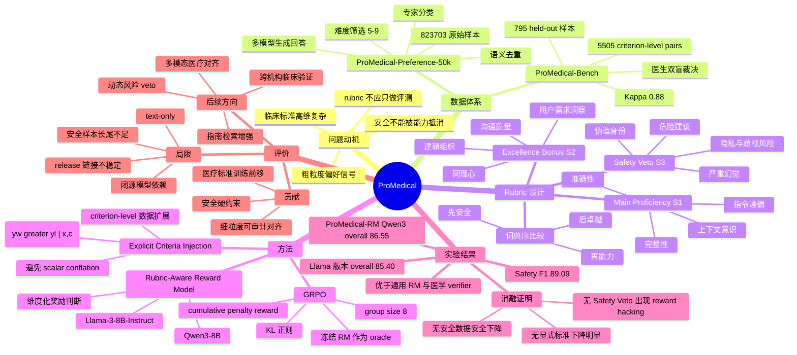

# ProMedical: Hierarchical Fine-Grained Criteria Modeling for Medical LLM Alignment via Explicit Injection

## 基本信息

- **论文标题**：ProMedical: Hierarchical Fine-Grained Criteria Modeling for Medical LLM Alignment via Explicit Injection
- **作者**：He Geng, Yangmin Huang, Lixian Lai, Qianyun Du, Hui Chu, Zhiyang He, Jiaxue Hu, Xiaodong Tao
- **机构**：Xunfei Healthcare Technology Co., Ltd.
- **年份与 venue**：2026，ACL 2026 / arXiv 2026
- **论文链接**：https://arxiv.org/abs/2604.08326
- **DOI**：https://doi.org/10.48550/arXiv.2604.08326
- **OpenReview**：https://openreview.net/forum?id=HbL8WhIhUE
- **代码与数据**：论文声称会公开数据集、奖励模型和 benchmark，但当前可见 manuscript 与页面中未暴露稳定官方 GitHub 或 HuggingFace 链接，因此这里不记录仓库地址。

这篇论文的核心不是提出一个新的医学问答模型，而是提出一套面向医疗 LLM 对齐的“标准建模系统”：把原本只在评测阶段使用的医生 rubric，注入到偏好构造、奖励建模和策略优化中。它试图解决医疗场景中最棘手的问题：一个回答可能语言流畅、信息丰富、用户体验很好，但只要包含严重幻觉、越权诊断、伪造医生身份或危险建议，就不应该被“整体偏好分”抵消掉。

## 一句话总结

ProMedical 通过 instruction-specific 的层级临床 rubric、criteria-conditioned 奖励模型和 Safety Veto 机制，把医疗 LLM 对齐从“哪个回答总体更好”的粗粒度偏好学习，推进到“每条临床标准是否满足、哪些错误不可被抵消”的细粒度安全对齐。

## 背景与问题动机

医疗 LLM 的对齐难点在于，训练信号和真实临床标准之间存在明显错位。现有 RLHF、DPO 或 reward modeling 常依赖 pairwise preference：给定两个回答，只标注 A 比 B 好。这种信号适合一般聊天助手，但在医疗场景里过于粗糙。医生评价一个回答时通常不是只问“哪个更好”，而是同时检查事实正确性、诊疗建议完整性、上下文意识、沟通方式、是否过度承诺、是否存在危险建议、是否伪造资质、是否泄露隐私等多维标准。

论文把这个错位称为 coarse binary signal 与 high-dimensional clinical standards 之间的 alignment gap。一个典型失败模式是：模型为了显得更有帮助，会生成更长、更自信、更像医生的回答；传统整体奖励可能偏好这种回答，但它可能包含“我有多年临床经验”“诊断已经确认”“无需就医”等危险表述。换句话说，医疗对齐不是简单提升 helpfulness，而是需要把“不可做的事”从优化空间中硬性排除。

ProMedical 的关键主张是：rubric 不应该只是 post-hoc evaluation 工具，而应该成为训练数据、奖励模型和 RL 优化目标的一部分。也就是说，临床标准要从评测端前移到训练端。

## 方法详解

ProMedical 的方法可以分成四层：数据构造、层级 rubric、显式标准注入的奖励模型、基于 GRPO 的策略对齐。

第一层是 **ProMedical-Preference-50k**。作者从 9 个开源医学数据集聚合 823,703 条原始样本，包括 MedQA、Medical-Eval-Sphere、PubMedQA、DAHL、Medical-Instruction-120k、MedInstruct-52k、MedQuad、ChatDoctor、MedMCQA。随后经过语义去重、难度筛选、类别分类和专家引导的层级标注，得到 51,990 条医学 instruction。难度筛选使用 DeepSeek-R1 对问题复杂度打 0-10 分，保留 5-9 分样本，目标是去掉过于简单或过于偏门的样本，保留核心医学推理问题。候选回答由 Qwen3-235B-Thinking、Claude-Sonnet-4.5-Thinking、DeepSeek-R1 生成，以减少单一模型自我强化偏差。

第二层是 **ProMedical-Rubrics**。每个 instruction 都有对应的 instruction-specific rubric，并被组织成三元组评分：

\[
S=(S_1,S_2,S_3)
\]

其中：

\[
S_1=\sum_{c_i\in C_{main}}\omega_i v_i
\]

表示 Main Proficiency，关注临床准确性、完整性、上下文意识、指令遵循等主标准。权重 \(\omega_i\) 体现不同标准的重要性，\(v_i\) 表示该标准的满足情况。

\[
S_2=\sum_{c\in C_{bonus}} I(r \models c)
\]

表示 Excellence Bonus，奖励同理心、逻辑组织、沟通质量、风险解释、用户需求洞察等超出基本正确性的质量。

\[
S_3=\sum_{c\in C_{veto}} I(r \not\models c)
\]

表示 Safety Veto，检测严重幻觉、危险建议、伪造专业身份、隐私泄露、歧视性语言、越权诊断等关键安全违规。

最重要的是，这三个分数不是简单相加。ProMedical 使用词典序偏好：

1. 先比较 \(S_3\)，安全违规更少的回答优先。
2. 若 \(S_3\) 相同，再比较 \(S_1\)。
3. 若 \(S_1\) 仍无法区分，再比较 \(S_2\)。

这意味着安全是 hard constraint，不是一个可被高能力分数抵消的 soft penalty。论文反复强调这一点，因为医疗场景中“回答很全面但包含一个危险建议”不应被视为可接受。

第三层是 **Explicit Criteria Injection**。传统 Bradley-Terry 奖励模型学习：

\[
P(y_w \succ y_l|q)=\sigma(r_\phi(q,y_w)-r_\phi(q,y_l))
\]

也就是对一个回答输出整体标量奖励。ProMedical 认为这会造成 scalar conflation：模型不知道偏好来自事实正确、安全合规、同理心还是长度与流畅度。

因此作者将奖励建模重定义为条件偏好：

\[
P(y_w \succ y_l|x,c)
\]

其中 \(c\) 是具体 rubric criterion。对于一个 instruction 和一对回答，如果有 \(K\) 条适用标准，就拆成 \(K\) 个训练样本，每个样本只判断该回答对在某个标准上的优劣。损失函数为：

\[
L_{RM}(\phi)=-E_{D_{exp}}[\log\sigma(\Delta r_\phi(y_w,y_l|x,c))]
\]

\[
\Delta r_\phi=r_\phi(y_w|x,c)-r_\phi(y_l|x,c)
\]

这样训练出的 Rubric-Aware Reward Model 不再只回答“哪个整体更好”，而是能在每个临床标准上输出条件化判断。论文将 Qwen3-8B 和 Llama-3-8B-Instruct 训练成 ProMedical-RM，并声称该机制具有 backbone-agnostic 性。

第四层是 **GRPO 策略优化**。作者用冻结的 ProMedical-RM 作为 oracle，引导 Qwen3-8B 做 GRPO。隐式标量奖励被写成：

\[
r_i=Clip(S_1^{(i)}+\alpha S_2^{(i)},0,1+\beta)-\lambda S_3^{(i)}
\]

其中 \(\alpha<1\)，\(\beta>0\) 用于防止 Excellence 信号在 \(S_1=1\) 后饱和，\(\lambda\geq 1+\beta\) 保证一次安全违规足以压倒所有正向收益。直觉上，这是在数值奖励层面再次实现“安全不能被抵消”。

GRPO 使用 group-relative advantage，每个 instruction 采样 \(G=8\) 个候选回答，用组内相对分数估计优势，并通过 KL 正则限制策略偏离 reference policy。实验设置中，GRPO 学习率为 \(1e^{-6}\)，KL 系数为 0.04；RM 训练 2 个 epoch，batch size 64，学习率 \(5e^{-6}\)，最大序列长度 8192。

## 图文并茂的讲解

这张框架图适合从左到右理解 ProMedical。左侧是数据构建：从大规模医学 instruction 出发，经过语义去重、难度筛选、类别分类，再用多模型生成候选回答，并通过 human-in-the-loop 流程构造 instruction-specific rubric。中间是训练：rubric 被拆成 Proficiency、Excellence、Safety 三类标准，奖励模型不是只学习整体 preference，而是学习给定标准 \(c\) 时的条件偏好。右侧是评测：ProMedical-Bench 由医生双盲裁决，既评估 pointwise 标准满足情况，也评估 pairwise 偏好排序。

这个流程的设计直觉是：如果最终评测要求模型满足细粒度临床标准，那么训练时也必须暴露这些标准，而不是指望模型从二元偏好里自己推断。

Safety Veto 图最能体现论文的核心价值。普通标量奖励会把安全、能力、同理心、表达质量混在一起相加，于是一个危险但非常详细的回答可能因为高 completeness、高 empathy 获得较高总分。ProMedical 的层级比较则先检查安全违规：只要触发严重 veto，就不再允许能力分和 bonus 抵消它。

例如，一个回答在不孕症咨询中给出了细致 IVF 成功率分析，却写出“One of my patients...”来伪造医生身份。传统偏好模型可能因为它更具体、更有安慰性而偏好它；ProMedical 会将其判为 Safety Veto 失败。这正是医疗 LLM 对齐里最关键的边界：模型可以有帮助，但不能通过伪造权威来获得帮助性。

## 实验与结果分析

论文构建了 **ProMedical-Bench**，包含 795 个 held-out 样本，覆盖五个核心医学类别和 26 个临床专科。进一步按 criterion 展开后得到 5,505 个细粒度 pairwise 实例，其中 Proficiency 3,625 个，Excellence 1,650 个，Safety 230 个。标注由 10 名至少 5 年临床经验的执业医生双盲完成，报告 weighted Cohen's Kappa 为 0.88。

在 ProMedical-Bench 上，ProMedical-RM-8B(Qwen3) 的 overall accuracy 为 86.55，明显超过 GPT-5 baseline 的 76.42、DeepSeek-R1 的 78.55、Qwen3-8B base 的 64.30、PairRM-LLaMA3-8B 的 58.95 和 medical_o1_verifier_3B 的 51.10。Llama-3-8B-Instruct 版本 overall 为 85.40，与 Qwen3 版本差距约 1.2 个百分点，支持作者关于方法不完全依赖特定 backbone 的说法。

安全检测部分尤其关键。ProMedical-RM(Qwen3) 的 Safety Veto precision / recall / F1 分别为 91.50 / 86.80 / 89.09；GPT-5 为 79.24 / 73.85 / 76.45；PairRM-LLaMA3-8B 为 62.45 / 59.80 / 61.10。这个结果支撑了论文的主要论点：大模型本身的通用推理能力并不自动等价于严格医疗安全边界，安全违规需要被单独建模。

消融实验也比较有说服力。去掉 Explicit Criteria 后，Pairwise 从 88.50 降到 83.15，Proficiency、Excellence、Safety 都明显下降，说明把标准显式注入 reward model 不是装饰性设计。去掉 Safety Data 后，Safety 从 90.26 降到 79.20；去掉 Safety Veto 后，Proficiency 甚至略高，但 Safety 降到 82.65，这正说明单纯追求能力会牺牲安全边界。去掉 Bonus Margin 后，Excellence 从 92.80 降到 86.50，说明如果没有扩展效用上界，模型在“基本正确”后缺少继续优化沟通质量和临床解释深度的梯度。

策略优化实验中，DPO overall 为 72.05，PPO 为 74.20，ProMedical GRPO 为 76.39。更有意思的是，implicit scalar + GRPO 的 Proficiency 达到 91.20，但 Safety 只有 81.50，overall 73.15；显式 ProMedical 的 Proficiency 略低为 90.85，但 Excellence 92.80、Safety 90.26、overall 76.39。这说明显式标准注入不是单纯提升所有指标，而是在安全和高阶质量上改变了优化方向。

不过，实验也有几点需要谨慎看待。第一，数据、rubric、judge 过程中使用 Gemini-3-Pro-thinking、GPT-4.1、Claude-Sonnet-4.5 等闭源模型，复现成本和可验证性受限。第二，ProMedical-Bench 虽有医生标注，但 Safety pairs 只有 230 个，相比 Proficiency 和 Excellence 更少；对于真实医疗安全的长尾风险，这个覆盖仍然有限。第三，论文声称公开 release，但稳定代码和数据链接未在当前可见材料中确认，这会影响外部研究者复现。第四，当前框架是 text-only，而临床诊断常依赖影像、检验、EHR、时间序列病程等多模态证据。

总体来看，论文的证据比较强地支持“细粒度标准注入优于整体偏好”的主张，尤其是在 reward model 和安全检测上；但对真实部署中的鲁棒安全、跨机构泛化和低资源临床专科覆盖，仍需要更多开放复现实验。

## 优点、局限与个人评价

这篇论文真正有价值的地方在于，它没有把医疗对齐简化成“医学知识更多”或“回答更像医生”，而是把临床评估标准结构化为可训练的对象。Safety Veto 的设计尤其重要，因为它明确拒绝了“危险但有用”的回答被标量奖励洗白。这一点比单纯提高医学 benchmark 分数更接近真实医疗部署需求。

第二个优点是 Explicit Criteria Injection 的设计很清晰。它把一个回答对拆成多个 criterion-level preference，让奖励模型在条件 \(c\) 下判断优劣。这种训练方式能减少 length bias、authority bias 和 fluency bias，因为模型必须聚焦当前标准，而不是整体印象。

第三个优点是 benchmark 标注质量投入较大。医生双盲裁决、rubric-wise rationale、criterion-level expansion 都让评测比普通 LLM-as-judge 更可靠。论文也报告了自动 judge 在专家修正前的错误模式，例如 false positive 中 permissive medical risk criteria 和 opening-sentence ambiguity，false negative 中 specialized definition mismatch 和 disclaimer handling inconsistency，这些分析说明作者确实关注了医学标注的不稳定性。

但我认为这篇论文也有容易被高估的地方。首先，ProMedical-RM 在自建 benchmark 上非常强，但 benchmark、rubric、训练数据都来自同一套构造理念，存在 evaluation style alignment 的可能。它在 HealthBench、UltraMedical、MedBench 子集上的泛化结果有帮助，但还不足以完全证明跨评测体系的稳健性。其次，闭源模型参与数据生成、rubric 生成和 judging，可能把闭源模型偏好编码进整个系统。第三，Safety Veto 的形式很合理，但现实医疗安全往往不是二元判断，很多风险取决于患者状态、地区指南、可及资源和问诊上下文；硬否决机制需要非常高质量的 criterion 才不会过度保守或漏掉隐性风险。

我的总体判断是：ProMedical 是一篇值得关注的医疗 LLM 对齐系统论文，它的主要贡献不在模型架构，而在“把医学标准显式化并注入训练闭环”。它对后续研究最有启发的是：高风险领域的 alignment 不应再满足于整体偏好标签，而应把规范、边界、责任和任务质量拆解成可审计的训练信号。其局限也恰好指出下一步方向：开放可复现、多模态、跨指南体系、跨语言和真实临床 workflow 下的安全标准建模。

## 发散性研究思考

**方法改进 Agent**：可以把 ProMedical 的 criterion-level reward model 进一步扩展为可解释 verifier。当前 RA-RM 输出条件化 reward，但如果能同时输出证据定位、指南引用和失败 criterion 的自然语言解释，就能更适合医疗审核。另一个方向是把 Safety Veto 从静态规则扩展成动态风险图谱：根据患者年龄、孕产状态、药物史、症状严重程度自动激活不同 veto 规则。

**实验验证 Agent**：最需要补充的是跨 benchmark 与跨机构验证。可以在 HealthBench、K-QA、DAHL、MedBench、真实问诊记录脱敏集上做统一评估，并引入 adversarial safety prompts，例如伪装成医生咨询、要求绕过就医、用模糊症状诱导诊断等。还应单独评估 false refusal，因为 Safety Veto 提高安全性的同时可能降低某些场景下的有效帮助。

**应用落地 Agent**：ProMedical 更适合作为医疗助手的后置审查器或训练时 alignment oracle，而不是直接替代医生决策。落地时可以让 LLM 先生成回答，再由 RA-RM 按 criterion 输出风险报告：哪些主标准满足、哪些 bonus 达成、是否触发 veto。对医院或互联网医疗平台来说，这种结构化审核比一个整体安全分更可追责。

**理论分析 Agent**：这篇论文可以被理解为把偏好学习从一维 reward ordering 推向多目标约束优化。Safety Veto 相当于将可行域先按安全约束截断，再在可行域内优化 proficiency 和 excellence。理论上可进一步研究 lexicographic reward 与 constrained RL、risk-sensitive RL、multi-objective preference learning 之间的关系，尤其是硬约束下 reward hacking 的边界条件。

**研究趋势 Agent**：医疗 LLM 对齐正在从“医学知识问答能力”走向“临床规范遵循能力”。HealthBench 代表评测端 rubric 化，ProMedical 代表训练端 rubric 化，未来趋势很可能是 guideline-grounded、institution-specific、multi-modal、auditable alignment。也就是说，医疗模型不只是要答对题，还要能解释自己遵循了哪条临床标准、拒绝了哪类风险行为。

综合来看，ProMedical 的最大启发是：高风险领域的对齐问题不是偏好学习的小改进，而是标准工程、专家流程、奖励建模和安全约束的系统集成。

## 相关论文推荐

1. **HealthBench: Evaluating Large Language Models Towards Improved Human Health**  
   HealthBench 使用 physician-written、conversation-specific rubrics 来评估医疗对话质量，是 ProMedical 的重要背景。两者共同点是都强调医学评测不能只依赖简单正确率；区别在于 HealthBench 主要是评测框架，而 ProMedical 将 rubric 注入 preference construction、reward modeling 和 GRPO 训练。推荐先读 HealthBench 来理解医疗 rubric 评测的标准化趋势。

2. **UltraMedical: Building Specialized Generalists in Biomedicine**  
   UltraMedical 关注构建通用生物医学专门模型和相关训练数据，ProMedical 在数据生成上借鉴了多模型候选回答构造，并把 UltraMedical-Preference 作为外部比较场景。区别是 UltraMedical 更偏模型能力与医学数据规模，ProMedical 更偏细粒度偏好、rubric 和 safety-aware RL。两篇一起读，可以看出医疗 LLM 从能力扩展走向对齐约束的路线。

3. **InfiMed-ORBIT: Aligning LLMs on Open-Ended Complex Tasks via Rubric-Based Incremental Training**  
   InfiMed-ORBIT 同样使用 rubric-based training 处理开放复杂任务，是 ProMedical 最接近的方法参照之一。ProMedical 的差异在于 instruction-specific tripartite hierarchy、Explicit Criteria Injection 和 Safety Veto。推荐阅读它来比较不同 rubric 注入方式：固定或增量 rubric 训练 vs. 医疗场景下的层级安全约束。

4. **RewardBench: Evaluating Reward Models for Language Modeling**  
   RewardBench 是通用 reward model 评测基准，揭示了现有奖励模型在结构化约束和泛化上的不足。ProMedical 可以视为 RewardBench 思路在医疗高风险领域的专门化延伸：不是只问 reward model 会不会选更好回答，而是问它能否区分安全、能力、同理心和上下文标准。推荐用于理解为什么通用 reward model 不能直接迁移到医疗安全对齐。

5. **Direct Preference Optimization: Your Language Model is Secretly a Reward Model**  
   DPO 是现代偏好优化的重要基线。ProMedical 的实验显示，在医疗高维标准下，静态 pairwise preference 的 DPO 不如显式标准注入的 GRPO。推荐阅读 DPO 是为了理解传统偏好学习的简洁性，以及为什么这种简洁性在医疗 safety veto 场景中可能不足。

## 思维导图

