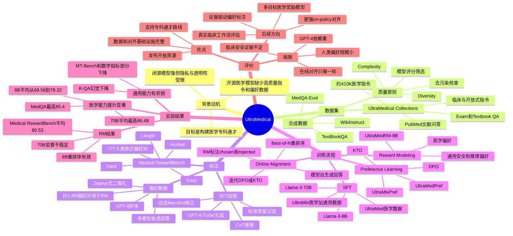

# UltraMedical: Building Specialized Generalists in Biomedicine

## 基本信息

- **论文标题**：UltraMedical: Building Specialized Generalists in Biomedicine
- **作者**：Kaiyan Zhang, Sihang Zeng, Ermo Hua, Ning Ding, Zhang-Ren Chen, Zhiyuan Ma, Haoxin Li, Ganqu Cui, Biqing Qi, Xuekai Zhu, Xingtai Lv, Jin-Fang Hu, Zhiyuan Liu, Bowen Zhou
- **机构**：Tsinghua University, University of Washington, The First Affiliated Hospital of Nanchang University, Shanghai Jiao Tong University, Frontis.AI
- **发表信息**：NeurIPS 2024 Datasets and Benchmarks Track Spotlight；arXiv 初稿 2024-06-06，修订版 2024-10-29
- **论文链接**：https://arxiv.org/abs/2406.03949
- **代码与资源**：
  - GitHub：https://github.com/TsinghuaC3I/UltraMedical
  - HuggingFace collection：https://huggingface.co/collections/TsinghuaC3I/ultramedical
  - Dataset：https://huggingface.co/datasets/TsinghuaC3I/UltraMedical
  - Preference dataset：https://huggingface.co/datasets/TsinghuaC3I/UltraMedical-Preference

## 一句话总结

UltraMedical 的核心贡献不是提出一个新模型结构，而是系统性构建了医学领域的指令、偏好、奖励模型和在线偏好学习资源，证明“医学专长 + 通用能力”的混合数据路线可以显著提升 Llama-3 系列开源模型的医学表现，但也暴露出 GPT-4 标注依赖、奖励模型弱监督和通用能力退化等问题。

## 背景与问题动机

医学大模型的发展有一个明显张力：闭源模型能力很强，但医疗场景对隐私、安全、可审计性和本地化适配要求极高；开源模型更容易部署、微调和审查，却长期缺少足够高质量的医学指令与偏好数据。

论文把这个矛盾概括为“specialized generalist”的构建问题。医学模型不能只会刷医学考试题，也不能只会生成看似专业的临床解释。一个有用的生物医学通才至少要同时覆盖：

- 医学考试与教材知识，例如 MedQA、MedMCQA、MMLU medical categories；
- 文献理解与科研问答，例如 PubMedQA；
- 临床和开放式医学问答，例如 K-QA、ChatDoctor、MedQuad；
- 通用对话、推理和数学能力，因为很多医学问题本身依赖多步推理、证据综合和自然语言交互。

过去的医学 LLM 路线大致有两类。第一类是 Med-PaLM、Med-PaLM 2、MedGemini、GPT-4 MedPrompt 等闭源或半闭源系统，通过强基础模型、提示工程、检索、CoT 和动态 few-shot 获得很强医学 benchmark 表现。第二类是 Meditron、BioMistral、Med42、OpenBioLLM 等开源医学模型，通常依赖医学语料继续预训练或医学指令微调。UltraMedical 的切入点不同：它认为当前开源医学模型的瓶颈不只是模型参数或领域语料，而是缺少类似 UltraChat、UltraFeedback、Zephyr 这类通用对齐生态在医学领域的系统性数据基础。

因此，论文试图回答的问题是：

1. 能否构建一个足够大、足够多样、足够复杂的开放医学指令集合？
2. 能否进一步构建医学偏好数据，使 DPO、KTO、reward modeling 和在线偏好学习进入生物医学 LLM 训练流程？
3. 医学专用数据和通用数据如何混合，才能让模型成为“专科通才”而不是只在医学题库上过拟合？
4. 医学 reward model 能否同时服务医学偏好判断、Best-of-N 重排序和进一步的在线对齐？

这篇论文的价值在于，它不是把医学大模型视为单次 SFT 产物，而是把数据构建、偏好标注、奖励建模和迭代对齐作为一个完整系统。

## 方法详解

### 1. UltraMedical Collections：医学指令数据构建

UltraMedical 首先构建约 410K 条医学指令，来源包括公开数据和自建合成数据。数据按任务类型大致分为三类：

- **Exam / textbook QA**：约占 50%，包括 MedQA、MedMCQA、MedQA-Evol、TextBookQA；
- **Literature QA**：约占 20%，主要是 PubMedQA；
- **Open-ended instruction/dialogue**：约占 30%，包括 MedQuad、MedInstruct-52k、Medical-Instruction-120k、ChatDoctor、WikiInstruct。

数据源的具体规模包括：

| 类型 | 数据集 | 保留数量 | 作用 |
|---|---:|---:|---|
| Exam | MedQA | 9,343 | 美国医学执照考试风格题 |
| Exam | MedMCQA | 58,871 | 印度医学入学考试题 |
| Exam | MedQA-Evol | 51,809 | 从 MedQA 演化得到的复杂题 |
| Exam | TextBookQA | 91,684 | 从医学教材段落合成的选择题 |
| Literature | PubMedQA | 88,688 | 基于 PubMed 摘要的文献问答 |
| Open-ended | MedQuad | 5,957 | NIH 网站医学问答 |
| Open-ended | MedInstruct-52k | 23,032 | 医学 instruction-following 数据 |
| Open-ended | Medical-Instruction-120k | 25,806 | 医学开放指令与合成回答 |
| Open-ended | ChatDoctor | 31,115 | 医患对话数据 |
| Open-ended | WikiInstruct | 23,288 | 基于 Wikipedia 生物医学概念扩展的指令 |

论文强调两个数据原则：**diversity** 和 **complexity**。

多样性来自任务、来源和医学知识形态的混合。考试题强调标准答案和结构化推理；PubMedQA 强调文献证据理解；开放式问答更接近真实咨询和科研解释。

复杂性则通过两条路线增强。对于公开数据，作者使用 `gpt-3.5-turbo` 按 1 到 10 分评估问题难度，筛选更复杂的问题。对于自建合成数据，作者先使用 self-evolution 扩展和改写指令，再用模型打分过滤。论文附录显示，模型复杂度评分与长度只有弱相关，因此不能简单把“长问题”当成“复杂问题”。

这里的设计直觉是：医学能力不是通过堆更多普通医学问答得到的，而是需要让模型反复接触包含多实体、多约束、多步判断和专业术语的问题。

### 2. Completion Annotation：用 GPT-4 生成 SFT 回答

UltraMedical 的 SFT 答案主要由 `gpt-4-turbo` 生成。对于选择题，论文使用 chain-of-thought 风格提示，让 GPT-4 逐步解释，再输出最终选项。随后系统会对照标准答案过滤错误回答。

如果 GPT-4 第一次回答错误，作者会动态检索少量 CoT 示例，再让 GPT-4 重新回答。这相当于把 MedPrompt 中动态 few-shot + CoT 的思想用于数据标注阶段：不是直接把问题交给 GPT-4，而是尽可能生成可蒸馏给小模型的高质量推理轨迹。

这一点很关键。UltraMedical 的 SFT 不是简单训练模型记答案，而是在把强模型的医学推理格式、解释风格和专业表达压缩进 Llama-3。

### 3. UltraMedical-Preference：医学偏好数据构建

在约 100K 到 110K 条高分医学指令上，作者收集多个模型的候选回答，并用 GPT-4 进行打分和排序。候选模型包括：

- `gpt-3.5-turbo`
- `gpt-4-turbo`
- Llama-3-8B / Llama-3-70B
- Qwen1.5-72B
- Mixtral-8x7B / Mixtral-8x22B
- SFT 后的 UltraMedical 8B

GPT-4 会根据医学场景中的准确性、完整性、清晰度和科学表达对回答打分并排序。作者使用 `gpt-4-2024-04-09`，试图减弱 GPT-4 对自身输出的偏好，但论文也承认 GPT-4-as-judge 仍然可能带来风格偏置和自我偏好。

偏好二值化遵循 Zephyr 风格：

- 排名最高的回答作为 chosen；
- 如果多个回答并列最高，优先选择 GPT-4 回答；
- 从较低排名回答中随机选择 rejected；
- 对 reward modeling，还可以从 8 个候选回答中扩展出最多 \(C_8^2 = 28\) 个偏好对。

最终，论文报告可用于 reward modeling 的偏好对约 1.8M。

这个设计让 UltraMedical 不只是 SFT 数据集，而是医学版的 instruction + preference + reward ecosystem。

### 4. Medical RewardBench：医学奖励模型基准

为了验证 reward model 是否真的懂医学偏好，作者从偏好数据中抽取 1,000 个样本，由医学专家修正 GPT-4 偏好。最终保留 777 个至少两名标注者一致的偏好对，分为：

- Easy：238
- Hard：196
- Length：180
- Human：163

其中 Human 子集尤其重要：它包含人类偏好与 GPT-4 偏好不同的样本，因此更能暴露模型是否只是复刻 GPT-4 的风格判断。

标注标准包括 Honest、Helpful、Harmless，以及避免 Length Bias。论文报告整个数据和标注流程的 GPT-4 API 成本约为 20,000 美元。

这个 benchmark 的规模不大，但它提供了一个信号：医学 reward model 不能只在通用 RewardBench 上表现好，还必须在专业知识、事实核查和临床安全判断上可靠。

### 5. UltraMedical Suites：SFT、DPO/KTO、RM 与在线偏好学习

论文基于 Llama-3-8B 和 Llama-3-70B 构建 UltraMedical 模型套件，训练流程包括四步。

第一步是 **SFT**。作者在 Llama-3 base/instruct 模型上使用 UltraMedical 指令进行监督微调。为了保留通用能力，还引入 UltraChat、ShareGPT、Open-Orca、Evol-Instruct、Camel Instructions、Orca-Math 等通用数据。主实验中：

- UltraMed：约 410K 医学指令；
- UltraMix：约 410K 医学指令 + 190K 通用指令。

第二步是 **preference learning**。作者在 UltraMedPref 和 UltraMixPref 上使用 DPO 与 KTO。DPO 的核心思想是直接优化模型让 chosen response 相对 rejected response 概率更高，常见形式可以理解为：

\[
\mathcal{L}_{DPO} =
-\log \sigma \left(
\beta \left[
\log \frac{\pi_\theta(y_w|x)}{\pi_{ref}(y_w|x)}
-
\log \frac{\pi_\theta(y_l|x)}{\pi_{ref}(y_l|x)}
\right]
\right)
\]

其中 \(y_w\) 是 chosen answer，\(y_l\) 是 rejected answer，\(\pi_{ref}\) 是参考模型。它不需要显式训练 reward model，但依赖偏好对质量。

KTO 则不要求严格成对偏好，而是基于 Kahneman-Tversky 价值函数思想，把 desirable / undesirable 样本转化为效用优化。论文将 DPO 和 KTO 都作为医学偏好学习的可选路线。

第三步是 **reward modeling**。作者训练 UltraMedRM-8B，基础模型是 Llama-3-8B-Instruct，训练数据包括 UltraMedical preference 以及 UltraFeedback、UltraSafety、UltraInteract 等通用偏好、安全和推理数据。目标是让 RM 同时具备医学判断和通用奖励能力。

第四步是 **online / iterative preference learning**。给定当前策略模型 \(\pi_0\)，模型先对混合指令生成多个回答，然后由 UltraMedRM 给生成回答和参考回答打分，构造新的 chosen/rejected 对，再进行 DPO/KTO 得到 \(\pi_1\)。理论上这个过程可重复 \(K\) 轮，得到 \(\pi_K\)。论文由于算力限制只执行了一轮。

此外，UltraMedical 还使用 **Best-of-N sampling**：从模型采样 N 个候选答案，不再用多数投票，而是用 reward model 重排序，选最高 reward 的答案。这既可以用于训练数据筛选，也可以用于推理阶段提升性能。

## 图文并茂的讲解

第一张图可以把 UltraMedical 的数据路线看成三层漏斗。

最底层是原始医学来源：考试题、医学教材、PubMed 文献、临床问答、医患对话、Wikipedia 生物医学概念。中间层是复杂度和多样性加工：公开数据经过模型难度评分和筛选，自建数据通过 self-evolution、教材段落出题和概念扩展生成更复杂指令。最上层是标注层：GPT-4 生成 SFT 回答，多个强模型生成候选回答，GPT-4 进行偏好排序，人类专家再修正一小部分偏好样本形成 Medical RewardBench。

这个流程的关键不是“合成数据越多越好”，而是把数据按用途拆开：SFT 需要高质量示范回答，DPO/KTO 需要 chosen/rejected 对，reward model 需要更丰富的偏好组合，benchmark 需要人类修正过的可信偏好样本。

第二张图展示的是 UltraMedical Suites 的训练闭环。流程从 Llama-3 基座模型开始，先用 UltraMedical / UltraMix 做 SFT，得到一个医学基础能力明显增强的 policy model。然后用 UltraMedical-Preference 进行 DPO 或 KTO，使模型更偏向高质量医学回答。与此同时，UltraMedical 偏好数据和通用偏好数据训练出 UltraMedRM，这个 reward model 又能对模型自己生成的回答进行打分，构造 on-policy 偏好数据，进一步做 iterative DPO/KTO。

这套流程的研究意义在于，它把医学 LLM 从“静态微调模型”推向“可持续对齐系统”。但论文也显示，这个闭环还没有完全跑通：reward model 对 8B 模型重排序效果更明显，对 70B 模型监督能力较弱；在线偏好学习只做了一轮；大部分偏好仍来自 GPT-4，而不是医学专家或可验证证据链。

## 实验与结果分析

### 医学多选题结果

UltraMedical 在医学选择题 benchmark 上提升显著，尤其是 8B 模型。

Llama-3-8B-Instruct 的医学平均分为 68.56。经过 UltraMedical 后：

- UltraMed + SFT：75.20
- UltraMed + DPO：76.61
- UltraMed + KTO：76.61
- UltraMix + SFT：75.90
- UltraMix + DPO：77.29
- UltraMix + Iterative DPO：77.51
- UltraMix Best ensemble：78.32
- MedQA USMLE 最高达到 76.1

这说明最主要的增益来自 SFT 数据本身，偏好学习带来的是进一步但相对较小的提升。对于 8B 模型，UltraMedical 能让其超过一些更大的早期医学模型，例如 Med-PaLM 1、Meditron-70B 和 GPT-3.5 在部分平均指标上的表现。

70B 模型也有提升，但边际收益更小。Llama-3-70B-Instruct 平均分为 82.66，UltraMedical 后：

- UltraMed + SFT：84.62
- UltraMed + DPO：85.57
- UltraMed + KTO：85.35
- UltraMix + SFT：84.27
- UltraMix + DPO：85.56
- UltraMix + KTO：85.84
- UltraMix Best ensemble：86.49
- MedQA USMLE 最高达到 85.4

这个结果接近 Med-PaLM 2 ER 的 85.4，也与 OpenBioLLM-70B 的平均结果相当或略高。但 GPT-4 MedPrompt 平均 90.76 仍明显领先，说明 UltraMedical 缩小了开源与闭源的差距，却没有真正达到最强闭源提示系统的水平。

### UltraMed vs UltraMix

一个重要发现是，混合通用数据的 UltraMix 往往略优于只使用医学数据的 UltraMed，尤其在 SFT + DPO/KTO 后更明显。这支持论文的“specialized generalist”命题：医学问题并不是孤立的专业知识调用，模型还需要通用推理、对话组织、数学能力和遵循复杂指令的能力。

但 UltraMix 不是无成本的。通用能力结果显示，UltraMedical 模型在医学长问答和幻觉控制上更好，但在一些通用 benchmark 上会下降。例如：

- UltraMedLM 8B 的 K-QA completeness 为 0.7242，高于 Llama-3-8B-Instruct 的 0.6037；
- hallucination 从 0.1940 降到 0.0945；
- 但 MT-Bench 从 8.10 降到 7.64，GSM8K 从 79.6 降到 75.9。

70B 也类似：UltraMedLM 70B hallucination 更低，但 MMLU、GSM8K 和 MT-Bench 相比 Llama-3-70B-Instruct 有不同程度下降。

这说明医学对齐并不是单纯“加能力”，而是会重塑模型行为分布。模型更愿意使用医学风格、谨慎表达和专业解释，但这可能削弱通用聊天、数学或广域知识 benchmark 上的表现。

### Preference Learning 的效果

DPO 和 KTO 确实带来提升，但提升幅度没有 SFT 大，且在 70B 上尤其有限。论文给出的解释是 off-policy mismatch：偏好数据里的候选回答来自 GPT-4、Qwen、Mixtral、Llama 等多个模型，它们的输出分布和目标 Llama-3 policy 不完全一致。因此，用这些偏好对训练目标模型时，收益会受限。

这一点很重要。它说明医学偏好学习不能只依赖“强模型回答池 + GPT-4 排序”。更理想的路线是让当前模型自己生成回答，再由 reward model 或专家系统标注，从而形成 on-policy preference。UltraMedical 尝试了一轮 iterative DPO/KTO，但受算力限制没有深入探索多轮在线对齐。

### Reward Model 结果

UltraMedRM-8B 在 Medical RewardBench 上平均分 80.53，高于多个通用 reward model：

- UltraMedRM-8B：80.53
- PairRM-LLaMA3-8B：78.48
- FsfairX-LLaMA3-RM-v0.1：76.03
- Eurus-RM-7B：75.95
- UltraRM-13B：75.08

在通用 RewardBench 上，UltraMedRM 平均 85.53，也保持竞争力，接近 FsfairX-LLaMA3-RM-v0.1 的 85.34，但低于 PairRM-LLaMA3-8B 的 87.13。

更有意思的是重排序实验。对于 Llama3-8B-UltraMix SFT，UltraMedical RM sorting 达到 79.52，高于 self-consistency 的 78.40 和 greedy 的 75.90。这说明 reward model 对 8B 模型的候选答案筛选有实际价值。

但在 70B 上，self-consistency 往往仍更强，RM 排序没有稳定超过多数投票。这揭示了一个风险：一个 8B reward model 不一定足以监督更强的 70B policy。医学 reward model 的规模、训练数据质量和事实核查能力仍是瓶颈。

### 证据是否支撑论文主张

论文较充分地支撑了三个主张：

1. **高质量医学 SFT 数据显著有效**：8B 和 70B 都有稳定提升，且 8B 增益特别明显。
2. **医学 + 通用混合数据有价值**：UltraMix 经常优于 UltraMed，说明专科能力不能脱离通用能力。
3. **医学 reward model 是必要组件**：UltraMedRM 在医学偏好判断和 8B 重排序中有明确收益。

但论文对以下主张的证据还不充分：

1. **在线偏好学习的长期有效性**：只做了一轮，无法判断多轮是否会持续提升或导致 reward hacking。
2. **临床可靠性**：评估仍主要是 benchmark QA 和 GPT-4-as-judge，不能证明真实医疗部署安全。
3. **偏好数据真实性**：大部分偏好来自 GPT-4，只有 777 个医学 reward benchmark 样本经过人类修正。
4. **奖励模型可扩展性**：8B RM 对 70B policy 的监督效果不稳定，说明 weak-to-strong reward supervision 仍未解决。

## 优点、局限与个人评价

### 真正有价值的点

我认为 UltraMedical 最大价值是把医学 LLM 的研究范式从“做一个医学微调模型”推进到“构建医学对齐基础设施”。它发布的不只是模型，还有 instruction dataset、preference dataset、reward benchmark、reward model 和训练 recipe。这对后续开源医学大模型研究非常重要，因为医学领域长期缺少可复用的偏好学习数据。

第二个价值是它认真处理了“专科通才”问题。很多医学模型容易在医学题库上变强，却牺牲通用能力。UltraMedical 明确比较 UltraMed 和 UltraMix，说明通用数据并不是医学训练的干扰项，而是医学推理和交互能力的一部分。

第三个价值是 Medical RewardBench 的提出。虽然规模不大，但它把医学 reward model 的评估从通用偏好迁移出来，开始关注 hard、human-disagreement 和 length-bias 这类更接近真实医学偏好困难点的问题。

### 可能被高估的点

论文中“GPT-4-level open-source medical LLM”的叙事需要谨慎理解。UltraMedical 70B 在 MedQA USMLE 上达到 85.4，确实接近 Med-PaLM 2 ER，但与 GPT-4 MedPrompt 的 90.2 仍有差距，平均结果也明显低于 GPT-4 MedPrompt。更重要的是，MedQA 这类 benchmark 不能代表真实临床能力。

偏好学习的贡献也可能被高估。实验显示 SFT 是主要增益来源，DPO/KTO 的提升相对有限。UltraMedical 的偏好数据非常有价值，但当前结果更像是证明“可用”，还不是证明“医学偏好学习已经成熟”。

### 主要局限

1. **GPT-4 依赖过重**  
   GPT-4 用于指令生成、SFT 回答、偏好排序和部分评估。这使数据质量较高，但也带来风格偏置、自我偏好和不可完全审计的问题。模型可能学到 GPT-4 式医学回答，而不一定学到可验证的医学事实判断。

2. **人类专家校正规模较小**  
   Medical RewardBench 最终保留 777 对偏好样本，相比约 100K 偏好指令和 1.8M 偏好对非常小。它适合作为初始 benchmark，但不足以全面校准医学 reward model。

3. **临床安全证据不足**  
   论文主要评估考试题、文献问答和开放问答。真实医疗场景还需要不确定性表达、禁忌证识别、患者个体差异、风险分层、责任边界、实时指南更新和专家审查流程。

4. **reward model 对强模型监督不足**  
   UltraMedRM 对 8B reranking 有效，但对 70B 不稳定。这说明医学 reward model 的能力上限、标注质量和 policy/RM scale matching 仍需研究。

5. **通用能力退化仍未解决**  
   UltraMedical 改善医学能力和 hallucination，但在部分通用 benchmark 上下降。如何动态控制医学专精与通用能力之间的权重，是后续部署中必须面对的问题。

### 个人评价

这篇论文是医学大模型数据工程和对齐工程的代表性工作。它的创新不在单个算法，而在把开放医学 LLM 所需的数据链条基本补齐。对于研究者，它提供了一个非常清晰的 baseline：如果要做开放医学模型，至少应该考虑 instruction diversity、complexity filtering、multi-model preference、human-corrected reward benchmark、domain reward model 和 online alignment。

但从临床应用角度看，它仍然是 benchmark-oriented medical assistant，而不是可直接部署的 clinical decision system。它更适合作为医学 LLM 研究平台，而不是最终医疗产品。

## 发散性研究思考

### 方法改进 Agent：如何改进模型和训练流程

UltraMedical 当前最明显的改进方向是减少 GPT-4 单点依赖。可以引入检索增强事实核查，把 PubMed、指南、药品说明书、临床路径作为偏好标注的证据来源。偏好不应只是“哪个回答更像好答案”，而应拆成事实正确性、证据引用、临床安全、拒答边界、个体化建议和不确定性表达等维度。

另一个方向是多 reward head。医学回答质量不是单一标量，至少包含 factuality reward、safety reward、helpfulness reward、conciseness reward、evidence reward。把它们合成一个总 reward 容易掩盖冲突。例如一个回答很详细但存在轻微药物禁忌错误，单一 reward 可能仍给高分；临床场景中这类错误应被强 veto。

在线偏好学习也可以更进一步：不只是让模型自采样，再由 RM 排序，而是让模型主动生成“有争议候选”，例如同一问题下生成保守建议、激进建议、证据型建议和患者友好型建议，再由专家或自动核查系统判断差异。

### 实验验证 Agent：还需要哪些实验

最需要的是更细粒度的 ablation。论文展示了 UltraMed、UltraMix、SFT、DPO、KTO、Iterative DPO 的总体效果，但还可以进一步拆解：

- 去掉 MedQA-Evol、TextBookQA、WikiInstruct 分别会怎样？
- 复杂度筛选与随机筛选相比是否显著更好？
- GPT-4 CoT 回答与短答案 SFT 对模型推理能力的影响有多大？
- 医学偏好数据和通用偏好数据的混合比例如何影响 reward model？
- Medical RewardBench 中 Human 子集到底哪些错误类型最难？

还需要真实临床风格评估。例如让模型处理多轮病史补充、冲突检查结果、患者用药史、指南更新、风险沟通和拒绝提供诊断结论的场景。当前 benchmark 仍偏静态问答，无法检验临床交互能力。

### 应用落地 Agent：如何走向真实场景

UltraMedical 更适合落地在医学教育、文献问答、医生辅助检索、病例讨论草稿生成等低风险场景，而不是直接面向患者给出诊疗决策。它在考试题和医学解释上表现强，但真实临床系统还需要外部知识库、审计日志、医生确认、人群适配和责任边界。

一个合理落地形态是“本地部署的医学研究助理”：支持医院或实验室在本地私有数据上继续微调，接入院内指南和文献库，为医生生成候选解释、鉴别诊断清单、文献摘要和患者教育材料。最终输出必须由医生确认。

在患者端应用上，应限制为健康教育和就医建议，不应给出确定诊断或处方。尤其是涉及急症、妊娠、儿童、肿瘤、精神健康、药物相互作用时，需要强制安全策略和人工转接。

### 理论分析 Agent：这篇论文暴露了哪些理论问题

UltraMedical 触及一个重要理论问题：领域专精和通用能力之间是否存在可避免的 trade-off？如果医学数据只是通用能力的子分布，理论上混合训练不应损伤通用能力；但实验显示部分通用指标下降，说明 SFT/DPO 会改变模型输出偏好和能力分布，而不仅是增加知识。

另一个问题是 reward model 的可迁移性。8B RM 能否可靠监督 70B policy？实验显示不稳定。这与 weak-to-strong supervision 相关：弱奖励模型可能识别普通错误，却无法区分强模型候选之间的细微医学质量差异。医学场景中这种差异往往最关键。

偏好数据的 off-policy 性也是理论问题。来自 GPT-4、Mixtral、Qwen 的偏好对未必覆盖 Llama-3 policy 会犯的错误，因此 DPO/KTO 的优化方向可能与目标模型真实改进方向不完全一致。这解释了为什么 offline preference learning 的收益有限。

### 研究趋势 Agent：这篇论文在领域趋势中的位置

UltraMedical 代表医学 LLM 从“模型竞赛”转向“数据和对齐基础设施竞赛”。早期医学模型关注继续预训练和 SFT，之后 MedPrompt 证明强通用模型加提示工程可以击败很多专用模型。UltraMedical 则试图把开源模型补齐到更完整的对齐流程：指令、偏好、RM、在线学习。

后续趋势大概率会走向三类方向：

1. **证据增强医学偏好学习**：偏好标注不再只靠 GPT-4，而是结合 PubMed、指南、知识图谱和事实核查。
2. **安全约束型 reward modeling**：从单一 helpfulness reward 变成多目标、可解释、带 veto 的医学奖励系统。
3. **真实临床工作流评估**：从 MedQA/PubMedQA 转向多轮病例、电子病历、医嘱审查、风险沟通和真实医生评价。

### 综合结论

UltraMedical 是开源医学大模型领域非常重要的数据与对齐基座。它证明了高质量医学指令和偏好数据能显著提升 Llama-3 医学能力，也说明通用能力对医学任务不可或缺。但它没有解决医学 AI 最难的问题：事实可验证、安全可控、专家级偏好规模化、真实临床可靠性。后续工作如果只在 UltraMedical 上继续刷 benchmark，收益会越来越有限；真正值得做的是把 UltraMedical 的数据框架升级为证据驱动、专家校准、可审计的医学对齐系统。

## 相关论文推荐

### 1. Med-PaLM / Med-PaLM 2

Med-PaLM 系列是医学大模型研究的早期标志性工作，展示了大规模语言模型在医学考试和专业问答上的潜力。Med-PaLM 2 在 MedQA 等 benchmark 上达到非常强的结果，是 UltraMedical 主要对标的闭源医学 generalist。

UltraMedical 相比 Med-PaLM 的主要区别是开源和数据基础设施化。Med-PaLM 强在模型能力和闭源系统优化，UltraMedical 强在公开 instruction、preference、reward benchmark 和 Llama-3 微调 recipe。推荐先读 Med-PaLM 系列理解医学大模型 benchmark 体系，再读 UltraMedical 看开源社区如何追赶。

### 2. MedPrompt

MedPrompt 证明 GPT-4 这类强通用模型通过动态 few-shot、chain-of-thought 和 self-consistency，可以在医学任务上超过很多专门微调模型。UltraMedical 的 SFT 答案生成和 CoT 标注思路与 MedPrompt 有明显联系。

两者差异在于，MedPrompt 是推理时提示工程路线，UltraMedical 是训练时数据蒸馏和偏好学习路线。MedPrompt 的结果更强，但依赖闭源模型；UltraMedical 性能略低，却能释放开源模型和数据。推荐对比阅读，以理解“强通用模型提示工程”和“开源专科通才训练”两条路线的优劣。

### 3. UltraFeedback / Zephyr

UltraFeedback 和 Zephyr 是通用领域 instruction + preference + DPO 生态的重要基础。UltraMedical 很大程度上是在医学领域复刻并扩展这一路线：先构建高质量指令，再收集多模型回答，由强模型标注偏好，最后进行 DPO/KTO 和 reward modeling。

UltraMedical 的贡献是把这一范式迁移到生物医学，并补充医学 reward benchmark。但它也继承了通用偏好学习的限制：LLM-as-judge 偏置、长度偏置、离线偏好与目标 policy 不匹配。推荐阅读它们来理解 UltraMedical 的方法来源。

### 4. RewardBench

RewardBench 是通用 reward model 评估的重要基准，UltraMedical 的 Medical RewardBench 明显受其启发。RewardBench 关注 chat、hard chat、safety、reasoning 等通用偏好能力；Medical RewardBench 则把评估转向医学 hard、human disagreement 和 length-bias 场景。

UltraMedical 相对 RewardBench 的改进在于领域化，但不足是规模较小。推荐将两者一起看：RewardBench 告诉我们 reward model 如何评估，UltraMedical 则说明专业领域 reward model 为什么需要单独 benchmark。

### 5. Meditron / BioMistral / Med42 / OpenBioLLM

这些工作代表开源医学 LLM 的不同路线，包括医学语料继续预训练、医学 instruction tuning 和开源模型适配。UltraMedical 与它们相比更强调数据多样性、偏好学习和 reward modeling，而不只是领域预训练或单阶段 SFT。

其中 OpenBioLLM-70B 在论文实验中是非常强的开源基线，UltraMedical 70B 的平均医学结果与其竞争甚至略优。推荐把这些模型作为背景阅读，以理解 UltraMedical 的定位：它不是第一个开源医学模型，但它是较早系统性构建医学偏好学习基础设施的工作。

## 思维导图

