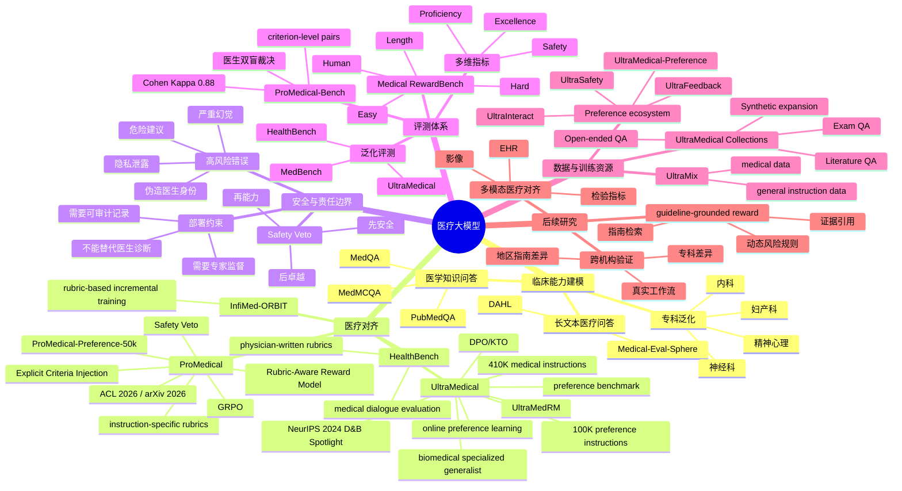

# 医疗大模型_思维导图

```mermaid
mindmap
  root((医疗大模型))
    临床能力建模
      医学知识问答
        MedQA
        PubMedQA
        MedMCQA
      长文本医疗问答
        Medical-Eval-Sphere
        DAHL
      专科泛化
        内科
        神经科
        妇产科
        精神心理
    医疗对齐
      ProMedical
        ACL 2026 / arXiv 2026
        ProMedical-Preference-50k
        instruction-specific rubrics
        Explicit Criteria Injection
        Rubric-Aware Reward Model
        Safety Veto
        GRPO
      HealthBench
        physician-written rubrics
        medical dialogue evaluation
      UltraMedical
        NeurIPS 2024 D&B Spotlight
        biomedical specialized generalist
        410K medical instructions
        100K preference instructions
        UltraMedRM
        DPO/KTO
        online preference learning
        preference benchmark
      InfiMed-ORBIT
        rubric-based incremental training
    安全与责任边界
      Safety Veto
        先安全
        再能力
        后卓越
      高风险错误
        严重幻觉
        危险建议
        伪造医生身份
        隐私泄露
      部署约束
        不能替代医生诊断
        需要专家监督
        需要可审计记录
    评测体系
      ProMedical-Bench
        医生双盲裁决
        criterion-level pairs
        Cohen Kappa 0.88
      多维指标
        Proficiency
        Excellence
        Safety
      泛化评测
        HealthBench
        MedBench
        UltraMedical
      Medical RewardBench
        Easy
        Hard
        Length
        Human
    数据与训练资源
      UltraMedical Collections
        Exam QA
        Literature QA
        Open-ended QA
        Synthetic expansion
      UltraMix
        medical data
        general instruction data
      Preference ecosystem
        UltraMedical-Preference
        UltraFeedback
        UltraSafety
        UltraInteract
    后续研究
      多模态医疗对齐
        影像
        检验指标
        EHR
      guideline-grounded reward
        指南检索
        证据引用
        动态风险规则
      跨机构验证
        专科差异
        地区指南差异
        真实工作流
```
