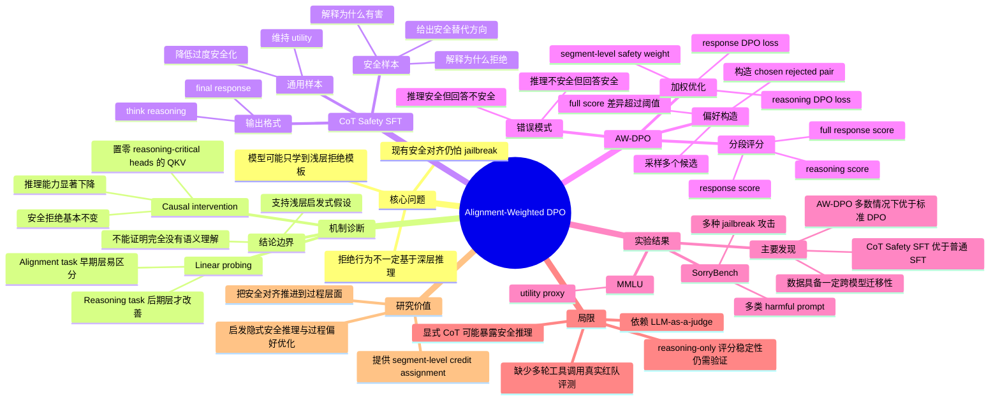

# Alignment-Weighted DPO: A principled reasoning approach to improve safety alignment

## 基本信息

| 项目 | 内容 |
|---|---|
| 论文标题 | Alignment-Weighted DPO: A principled reasoning approach to improve safety alignment |
| 作者 | Mengxuan Hu, Vivek V. Datla, Anoop Kumar, Zihan Guan, Sheng Li, Alfy Samuel, Daben Liu |
| 机构 | University of Virginia; Capital One |
| 发表信息 | ICLR 2026 Poster；OpenReview 显示 Published: 26 Jan 2026 |
| arXiv | 2602.21346v1，提交日期 24 Feb 2026 |
| 官方链接 | https://arxiv.org/abs/2602.21346 |
| 代码与数据 | 论文附录称审稿阶段提供匿名 CoT dataset 链接，并计划在接收或发表后释放完整代码和数据；当前不应视为已有稳定官方 GitHub 仓库 |

这篇论文讨论的是大模型安全对齐后训练。它的核心判断是：许多已对齐模型面对直接有害请求时能拒绝，但面对改写、诱导、编码、多语言、逻辑包装、角色扮演等 jailbreak 攻击时仍会失败，因为模型学到的往往是“看起来像有害请求就拒绝”的浅层模式，而不是基于推理理解请求为什么有害。

## 一句话总结

AW-DPO 试图把安全拒绝从“模板化说不”推进到“基于推理知道为什么不能做”，做法是先用长 CoT 安全数据训练模型，再把输出拆成 reasoning trace 和 final response 两段，分别根据安全评分加权 DPO 更新，从而更细粒度地纠正越狱失败。

## 背景与问题动机

现有安全对齐方法主要包括 SFT、RLHF、DPO 等。它们确实能降低模型对直接有害请求的配合程度，但论文指出一个更棘手的问题：这些方法可能只把安全行为压在输出开头或拒绝模板上。例如模型学会生成 “Sorry, I can’t help with that”，但不一定真正理解请求背后的意图、约束和潜在危害。一旦攻击者把同一意图包装成教学、翻译、低资源语言、编码、逻辑推演或角色扮演，模型就可能绕过这层浅表拒绝。

作者把这个现象称为 shallow refusal heuristics。为了验证它，他们没有直接从 benchmark 结果推断，而是先做了一个 preliminary causal intervention：用 linear probing 找出对 reasoning task 关键的 attention heads，再把前 11 层中 probing accuracy 最高的 top 10% reasoning-critical heads 的 Q/K/V 权重置零。结果显示，模型推理任务准确率明显下降，接近随机；但 safety probing 或拒绝行为基本保持不变。论文据此认为，当前模型安全拒绝机制与深层推理能力之间耦合较弱。

这个证据很有启发性，但不能被理解为“模型完全没有安全理解”。更稳妥的说法是：在作者定义的 reasoning probing、head selection 与 Q/K/V zeroing 干预下，模型的安全拒绝行为没有明显依赖这些 reasoning-critical heads。这支持“安全对齐可能过度依赖浅层特征”的假设，但还不能排除模型通过其他表征路径、语义特征或训练后形成的安全 circuit 完成拒绝。

这张图适合把论文的核心动机拆成两条路径：一条是浅层安全机制，只根据 prompt 表面特征触发拒绝；另一条是 reasoning-grounded alignment，先判断请求意图、风险类型、可替代安全帮助方式，再生成拒绝或安全回答。论文的贡献正是在第二条路径上做后训练。

## 方法详解

论文方法可以分成三层：因果诊断、CoT 安全微调、AW-DPO 偏好优化。

第一层是因果诊断。作者对 alignment task 和 reasoning task 分别训练 attention-head-level 的 logistic regression probe。alignment task 用 harmful 与 benign 输入区分安全类别，reasoning task 用 CommonsenseQA 中正确答案与错误答案构造分类样本。结果显示，alignment 在很多层、很多 head 上几乎很早就能线性分开，而 reasoning 在早期层更接近随机，后期层才逐渐变好。作者进一步干预 reasoning-critical heads 后，推理准确率显著下降，安全拒绝率几乎不变。这是后续方法设计的动机：如果安全机制没有真正依赖推理，就需要把安全推理显式纳入训练。

第二层是 CoT-based safety SFT。作者构造 long-form CoT safety fine-tuning dataset，混合两类样本：

1. 安全相关样本：来自 RepNoise-BeaverTails，训练模型说明请求为什么有害、为什么应该拒绝，以及如何给出安全替代回应。
2. 通用 utility 样本：论文正文与附录存在 LIMA/Alpaca 表述差异，整体目标是引入通用指令数据，避免模型只学会过度拒绝而损害一般能力。

训练格式借鉴 reasoning model，把推理过程放在 `<think>...</think>` 中，后面接最终回答。这个阶段的目的不是只模仿拒绝模板，而是让模型学会把 harmfulness 判断、政策边界和安全替代建议连接起来。

第三层是 Alignment-Weighted DPO。作者观察到 CoT Safety SFT 后仍有两类关键错配：

1. reasoning trace 看起来正确、安全，但 final response 仍泄露不安全内容。
2. reasoning trace 本身不正确或不安全，但 final response 最后是安全拒绝。

标准 DPO 只把整个 output 当作一个整体做 chosen/rejected 偏好优化，因此很难知道到底应该主要纠正 reasoning 还是 final response。AW-DPO 的想法是把输出按 `</think>` 拆成两个 segment：reasoning segment 与 response segment，然后分别计算 DPO loss，并按 segment-level 安全差异分配权重。

标准 DPO 可写成：

$$
L_{DPO} = - \sum_i \log \sigma(\phi(x_i, y_i^p) - \phi(x_i, y_i^n))
$$

其中隐式 reward 通常来自 policy model 与 reference model 的 log-probability ratio：

$$
\phi(x,y)=\gamma \log \frac{\pi_\theta(y|x)}{\pi_{ref}(y|x)}
$$

AW-DPO 把 reward 进一步拆到 token segment：

$$
\phi_{AW}(x,y)=\sum_{t=1}^{T} w_{s_t}\log \frac{\pi_\theta(y_t|x,y_{<t})}{\pi_{ref}(y_t|x,y_{<t})}
$$

其中 \(s_t\) 表示 token 属于 reasoning 还是 response。论文最后把 reasoning loss 与 response loss 加权：

$$
L_{AW-DPO}=w_{reasoning}L_{DPO}^{rs}+w_{response}L_{DPO}^{rp}
$$

训练数据构造流程是：对每个 adversarial harmful prompt，用 CoT-finetuned model 采样 \(k\) 个候选；用 GPT-4o judge 分别给 full response、reasoning-only、response-only 打 harmfulness score；若两个候选 full score 差异超过阈值 \(\gamma\)，就构造 chosen/rejected pair；再用 reasoning 与 response 的 segment-level score difference 计算权重。

这里有一个实现上需要特别注意的点：论文正文把 judge 分数描述为 harmfulness score，0 表示安全、1 表示有害；但公式和附录中 chosen/rejected、accepted/rejected 的表述存在一些容易混淆的地方。若实际使用 harmfulness 分数，权重差值必须保证符号与 chosen/rejected 定义一致，并且需要非负归一化，否则会出现“更有害的一段反而被错误加权”的风险。论文主张的核心不是某个符号本身，而是“把偏好优化压力集中到更需要修正的 segment”。

## 图文并茂的讲解

AW-DPO pipeline 可以按四步理解。

第一步，模型先经过 CoT Safety SFT，具备生成 `<think> reasoning </think> final response` 的格式能力。输入一个经过 jailbreak 包装的有害 prompt 后，模型采样多个候选输出。这些候选可能有不同错误类型：有的推理错、回答安全；有的推理安全、回答不安全；有的两者都不安全；也有的两者都安全。

第二步，judge model 不只评价整段输出，还分别评价 reasoning trace 和 final response。这样可以识别“表面最终拒绝但内部推理已经接受有害前提”的样本，也能识别“推理知道有害但最后回答失控”的样本。

第三步，根据 full response harmfulness score 选择 preference pair。只有当两个候选之间安全差异足够大时，才纳入 DPO 数据，避免把近似样本的噪声放大。

第四步，把 DPO 更新拆成两部分。如果 reasoning segment 的安全差异更大，就让 reasoning loss 权重更高；如果 final response 的差异更大，就让 response loss 权重更高。直觉上，这比标准 DPO 更像“局部修错”：不是简单告诉模型整个回答 A 比 B 好，而是告诉模型这次真正坏在哪里。

这个设计的价值在于，它把安全对齐从 response-level preference 细化到 process/answer 两个层次。对 CoT 模型来说，这一点很关键，因为安全失败不一定只发生在最终答案中，也可能已经发生在模型内部的推理轨迹里。

## 实验与结果分析

论文的安全评测主要使用 SorryBench，覆盖 20 种 jailbreak attacks 与 44 类 harmful prompt；utility 主要用 MMLU。DPO preference construction 使用 WildJailbreak adversarial harmful prompts 生成候选。模型包括 LLaMA-2-7B、LLaMA-3.2-3B、LLaMA-3.1-8B、Mistral-7B-v0.3 等。

主结果显示，CoT Safety SFT 相比普通 SFT、Safety SFT、Vanilla CoT SFT 更能降低 attack success rate，同时 utility 保持相对稳定。例如在 LLaMA-3.2-3B 上，Base 平均 unsafe rate 约 40.70%，CoT Safety SFT 降到约 7.60%；在 LLaMA-3.1-8B 上，Base 约 39.02%，CoT Safety SFT 降到约 5.42%。这说明“安全推理数据”本身已经有明显价值，不只是 CoT 格式带来的泛化。

DPO 阶段进一步降低 unsafe rate，而 AW-DPO 在多数模型上优于标准 DPO。典型结果包括：

| 模型 | 标准 DPO 平均 unsafe rate | AW-DPO 平均 unsafe rate | Utility 变化 |
|---|---:|---:|---:|
| LLaMA-3.2-3B | 约 1.04% | 约 0.58% | 50.64% 降至 48.52% |
| LLaMA-3.1-8B | 约 1.00% | 约 0.81% | 57.98% 升至 58.27% |
| Mistral-7B-v0.3 | 约 3.78% | 约 0.91% | 41.45% 升至 54.70% |

其中 Mistral 的结果尤其突出：标准 DPO 虽然增强安全，但 utility 明显下降；AW-DPO 同时改善 safety 与 utility。这支持作者的主张：粗粒度 DPO 可能把所有 token 一起惩罚，导致过度更新；分段加权可能让训练信号更集中。

论文还和 SAFECHAIN、Representation Rerouting、STAIR 等方法比较。在 LLaMA-3.1-8B 设置下，AW-DPO safety 表现很强；但 STAIR-DPO-3 的 utility 和 safety 也很有竞争力。作者指出 STAIR-DPO-3 需要多轮 SFT 与 DPO，训练成本更高，而 AW-DPO 只用一轮 SFT 与 DPO。这个比较说明 AW-DPO 的优势不只是绝对指标，也包括训练流程相对简洁。

迁移实验也值得关注。作者用 LLaMA2-7B 构造的 AW-DPO 数据迁移训练 LLaMA3.2-3B、LLaMA3.1-8B、Mistral-7B，仍能获得较低 unsafe rate，只是相较每个模型专门构造数据略有下降。这说明 preference dataset 里可能捕捉到一定模型无关的安全错误模式。

消融方面，AW-DPO 相比标准 DPO 在 LLaMA-3.1-8B 上平均 unsafe rate 从约 1.83% 降到约 0.81%，utility 从 57.66% 略升到 58.27%。缩放系数 \(\alpha\) 在 0.05 到 0.5 之间较稳定；学习率更敏感，过高学习率会明显破坏 utility。prefix attack 实验中，给 prompt 追加 `<think></think>` 试图迫使模型跳过推理，AW-DPO 仍保持较低 unsafe rate，说明安全行为并不完全依赖显式输出长推理。

不过，证据仍有边界。SorryBench 和 WildJailbreak 覆盖了多种 jailbreak 形式，但还不能代表真实多轮对话、工具调用、跨语言细粒度政策、医疗/金融/法律垂直规范、人类红队长程交互等部署场景。MMLU 也只是通用能力 proxy，不能充分说明 helpfulness、instruction following、over-refusal 和专业任务能力是否保持。

## 优点、局限与个人评价

这篇论文最有价值的地方在于，它没有只提出一个“更安全”的训练 recipe，而是先用 causal intervention 解释为什么当前安全机制可能脆弱，再基于 CoT 错误类型设计分段 DPO。方法链条比较完整：机制诊断、数据构造、失败模式分析、目标函数改造、跨模型验证都有对应证据。

AW-DPO 的另一个优点是设计直觉清晰。对 reasoning model 或显式 CoT 模型来说，“推理段安全”和“最终回答安全”确实不是同一个问题。标准 DPO 的 preference signal 太粗，容易把局部错误扩散成全局更新。AW-DPO 用 segment-level judge score 加权，是一个相对直接但有效的改造。

但它也有几个明显局限。

第一，causal intervention 的结论容易被过度解读。linear probing 找到的是某种线性可分信息，Q/K/V zeroing 干预的是特定 heads。模型安全行为不变，说明当前拒绝不依赖这些被定义为 reasoning-critical 的组件，但不等于模型完全没有深层安全理解。

第二，方法高度依赖 LLM-as-a-judge。reasoning-only、response-only、full response 三类分数直接决定 preference pair 和 segment weights。如果 judge 对长 CoT、隐含有害意图、反事实上下文、跨语言攻击不鲁棒，AW-DPO 就可能学习到 judge 偏差。附录中 judge prompt perturbation 的相关性显示 response-only 较稳定，但 reasoning-only 相关性相对较低，这正好触及 AW-DPO 的关键环节。

第三，显式 CoT 安全训练有部署风险。训练模型输出安全 reasoning 可能提高可解释性，但也可能暴露模型的拒绝策略、政策边界或被攻击者利用来优化 prompt。实际产品中可能更希望内部推理不外显，或者只输出简洁安全解释。因此 AW-DPO 的思想也许更适合“训练时使用 reasoning trace，推理时隐藏或压缩 reasoning”。

第四，实验主要证明 jailbreak refusal robustness，而不是完整安全对齐。真正部署中的安全问题还包括过度拒绝、灰区请求处理、上下文累积诱导、工具调用权限、检索增强污染、用户画像与隐私、合规政策冲突等。AW-DPO 能否处理这些问题，还需要更广泛测试。

我的总体判断是：这是一篇有实际启发的安全后训练论文。它的亮点不是“CoT 能提升安全”这个单点，而是把 CoT 失败模式转化成了 DPO 目标函数中的结构化归因。可能被高估的部分是“证明当前安全 alignment 不依赖 reasoning”的强表述；真正稳健的贡献是：在 CoT 安全模型中，reasoning 与 response 的错配是一个真实优化对象，而 AW-DPO 给出了一个简单、可迁移、可扩展的处理方式。

## 发散性研究思考

**方法改进 Agent：**  
AW-DPO 目前只分 reasoning 与 response 两段，粒度仍然偏粗。后续可以把 reasoning 进一步切成 intent recognition、policy classification、risk analysis、safe alternative planning 等步骤，做 step-level preference 或 process reward。另一个方向是让模型内部学习隐式 safety reasoning，而不是强制显式输出 `<think>`，从而降低暴露推理的部署风险。

**实验验证 Agent：**  
最需要补的是多轮和跨域评测。可以设计攻击者逐步试探边界的 multi-turn jailbreak，测试 AW-DPO 是否只是对单轮 SorryBench 模式适配。还应加入 over-refusal 评测，尤其是 benign-but-sensitive prompts，判断模型是否把复杂请求一律拒绝。对 judge bias，也需要人类标注子集或多个独立 judge 交叉验证。

**应用落地 Agent：**  
在真实产品中，AW-DPO 更适合作为 safety post-training 的一环，而不是独立安全方案。它可以和 policy classifier、tool permission system、retrieval sanitization、runtime monitor 结合。对于金融、医疗、教育等高风险场景，训练时可使用领域政策 CoT，但线上只暴露简洁解释，避免长 reasoning 被用户反向利用。

**理论分析 Agent：**  
AW-DPO 可以理解为一种结构化 preference optimization：把输出空间按语义 segment 划分，并对不同 segment 施加不同 KL-regularized preference 更新。理论上值得分析的是：segment weight 噪声如何影响 DPO 的隐式 reward 学习；当 judge 分数有偏时，AW-DPO 是否比标准 DPO 更容易放大局部偏差；以及分段权重是否能被解释为一种 token-level credit assignment。

**研究趋势 Agent：**  
这篇论文处在两个趋势交汇处：一是 safety alignment 从“拒绝结果”转向“拒绝理由与过程”；二是 preference optimization 从 response-level 走向 process-level、segment-level、token-level。随着 reasoning model 普及，安全对齐不再只关心最终答复是否合规，还会越来越关心模型在推理过程中是否接受了危险前提、是否产生了隐含计划、是否能稳定识别灰区意图。

综合来看，AW-DPO 的后续价值在于推动“安全对齐的 credit assignment”问题。未来更强的安全训练方法可能不会只问哪个回答更好，而会问：哪一步推理错了，哪个约束被忽略了，哪个 token 区间真正导致了 unsafe behavior。

## 相关论文推荐

**Direct Preference Optimization: Your Language Model is Secretly a Reward Model**  
这是 AW-DPO 的直接方法基础。标准 DPO 把 chosen/rejected response 作为整体优化对象，避免了显式 reward model 和 RLHF 的复杂训练。AW-DPO 的改进在于把 DPO loss 拆到 reasoning 与 response 两个 segment 上，并引入安全差异权重。建议先读 DPO 原文理解 implicit reward、KL regularization 与 preference loss，再看 AW-DPO 如何做结构化扩展。

**SAFECHAIN: Safety of Language Models With Long Chain-of-Thought Reasoning Capabilities**  
SAFECHAIN 与本文同属 CoT safety alignment 方向，都强调长推理对安全行为的重要性。差异在于 SAFECHAIN 更偏向用长 CoT 数据增强 reasoning model 的安全性，而 AW-DPO 进一步从 CoT 失败模式出发，设计了分段加权偏好优化。读 SAFECHAIN 有助于理解“长 CoT 安全数据”这条路线的前置工作。

**SorryBench: Systematically Evaluating Large Language Model Safety Refusal Behaviors**  
这是本文主要安全评测基准。它系统覆盖多类 jailbreak 攻击与有害请求类别，使论文能够报告不同攻击类型下的 unsafe rate。阅读 SorryBench 可以帮助判断 AW-DPO 的实验覆盖范围，也能看到评测本身对 refusal behavior 的定义边界。

**WildTeaming at Scale / WildJailbreak**  
本文使用 WildJailbreak adversarial harmful prompts 构造 DPO preference 数据。WildJailbreak 的价值在于提供更接近真实越狱尝试的 adversarial prompts，而不是只使用直接有害请求。它和 AW-DPO 的关系是数据层面的：AW-DPO 的训练信号很大程度依赖这些 adversarial prompt 能否覆盖真实攻击分布。

**Safety Alignment Should Be Made More Than Just a Few Tokens Deep**  
这篇工作关注安全对齐可能只作用在输出早期 token 的问题，与 AW-DPO 的“浅层拒绝启发式”动机高度相关。不同之处在于，AW-DPO 选择从 reasoning-aware post-training 和 segment-level DPO 入手，而该方向更强调安全行为不能只依赖开头拒绝模式。两者一起读，可以更完整理解“安全对齐深度不足”的问题。

## 思维导图

