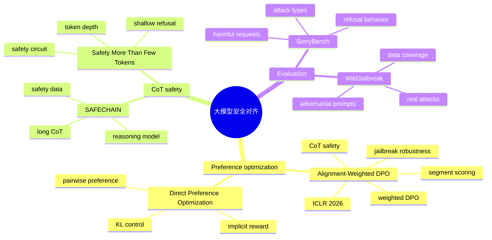

# 大模型安全对齐_思维导图

```mermaid
mindmap
  root((大模型安全对齐))
    Preference optimization
      Alignment-Weighted DPO
        ICLR 2026
        CoT safety
        segment scoring
        weighted DPO
        jailbreak robustness
      Direct Preference Optimization
        implicit reward
        KL control
        pairwise preference
    CoT safety
      SAFECHAIN
        long CoT
        safety data
        reasoning model
      Safety More Than Few Tokens
        shallow refusal
        token depth
        safety circuit
    Evaluation
      SorryBench
        refusal behavior
        harmful requests
        attack types
      WildJailbreak
        adversarial prompts
        data coverage
        real attacks
```
