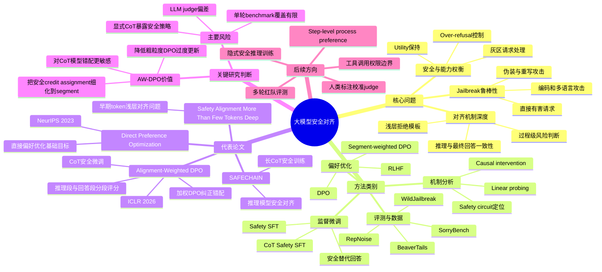

# 大模型安全对齐_思维导图

```mermaid
mindmap
  root((大模型安全对齐))
    核心问题
      Jailbreak鲁棒性
        直接有害请求
        伪装与重写攻击
        编码和多语言攻击
      安全与能力权衡
        Utility保持
        Over-refusal控制
        灰区请求处理
      对齐机制深度
        浅层拒绝模板
        过程级风险判断
        推理与最终回答一致性
    方法类别
      监督微调
        Safety SFT
        CoT Safety SFT
        安全替代回答
      偏好优化
        RLHF
        DPO
        Segment-weighted DPO
      机制分析
        Linear probing
        Causal intervention
        Safety circuit定位
      评测与数据
        SorryBench
        WildJailbreak
        BeaverTails
        RepNoise
    代表论文
      Alignment-Weighted DPO
        ICLR 2026
        CoT安全微调
        推理段与回答段分段评分
        加权DPO纠正错配
      Direct Preference Optimization
        NeurIPS 2023
        直接偏好优化基础目标
      SAFECHAIN
        长CoT安全训练
        推理模型安全对齐
      Safety Alignment More Than Few Tokens Deep
        早期token浅层对齐问题
    关键研究判断
      AW-DPO价值
        把安全credit assignment细化到segment
        降低粗粒度DPO过度更新
        对CoT模型错配更敏感
      主要风险
        LLM judge偏差
        显式CoT暴露安全策略
        单轮benchmark覆盖有限
    后续方向
      隐式安全推理训练
      Step-level process preference
      多轮红队评测
      工具调用权限边界
      人类标注校准judge
```
