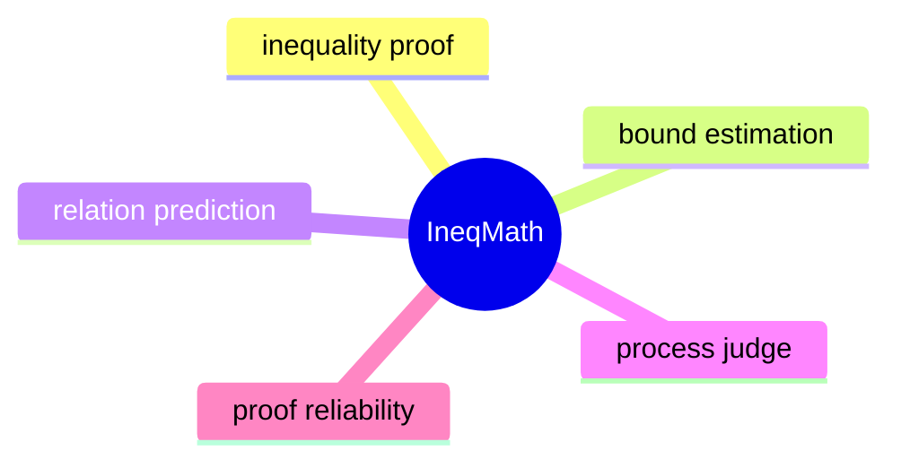

# IneqMath：不等式证明中的数学推理评测

## 基本信息

- 论文标题：Solving Inequality Proofs with Large Language Models
- 作者与机构：Pan Lu、Jiayi Sheng、Luna Lyu、Jikai Jin、Tony Xia、Alex Gu、James Zou；Stanford University、UC Berkeley、MIT
- 发布时间：arXiv v1 于 2025-06-09 提交，v3 于 2025-12-15 更新；OpenReview 记录为 NeurIPS 2025 Datasets and Benchmarks Track Spotlight，最近修改于 2026-04-23
- 论文链接：[arXiv](https://arxiv.org/abs/2506.07927)，[OpenReview](https://openreview.net/forum?id=ZaKGh4wP87)，[NeurIPS Poster](https://nips.cc/virtual/2025/poster/121573)
- 代码链接：[GitHub](https://github.com/lupantech/ineqmath)
- 项目主页：[IneqMath](https://ineqmath.github.io/)
- 数据与评测：[Hugging Face Dataset](https://huggingface.co/datasets/AI4Math/IneqMath)，[Evaluation](https://huggingface.co/spaces/AI4Math/IneqMath-Leaderboard)
- 所属研究方向：数学 Reasoning / 数学证明评测 / 过程监督
- 关键词：mathematical reasoning, inequality proving, LLM-as-judge, process evaluation, theorem proving
- 推荐阅读等级：高。它不是单纯报告新 leaderboard，而是把“数学证明是否可靠”从 final answer accuracy 推进到 step-wise proof soundness。
- 本次选题理由：用户要求“最新顶会的数学相关 reasoning 论文”。这篇论文是 NeurIPS 2025 Spotlight，项目页标注 Top 3%，OpenReview 和 NeurIPS 页面均确认其为 NeurIPS 2025 Datasets and Benchmarks Track 论文；主题又直接对准数学证明推理。

## 一句话总结

IneqMath 的核心贡献是把奥赛级不等式证明改写为两个可自动检查但仍保留证明难度的任务：bound estimation 和 relation prediction；然后用一个“最终答案 judge + 四个过程 judge”的评测框架证明：当前强推理模型即使能猜到正确答案，也经常无法给出逻辑严密、逐步可靠的证明链。

## 背景与问题动机

数学 reasoning 的常见 benchmark 主要看最终答案，例如 GSM8K、MATH、AIME。这个范式对“算出一个数”很有效，但对“证明一个命题”不够，因为证明的价值不只在结论，还在每一步推导是否成立。IneqMath 刻意选择不等式证明，就是因为它同时需要三类能力：发现 tight bound 的直觉、选择 AM-GM / Cauchy-Schwarz / Jensen 等经典定理的策略、以及精确的符号变形。

这篇论文解决的不是“LLM 能不能做数学题”这个宽问题，而是更尖锐的问题：**当 LLM 生成一段看似合理的不等式证明时，我们怎样判断它是真的证明了，还是只是给了一个碰巧正确的 final answer？**

已有路线大致有三类不足：

1. 纯 final-answer 评测容易高估模型。只要模型猜到常数或关系符号，就会被算作正确，但中间可能用 toy case 代替一般证明、跳过关键逻辑、用数值近似冒充解析证明。
2. 完全形式化证明评测很严格，但门槛高。Lean / Isabelle 这类 proof assistant 能保证正确性，可是问题和证明都必须写成形式语言，和大多数 LLM 擅长的自然语言/LaTeX 式非形式证明有落差。
3. 现有不等式相关数据集要么规模小，要么偏合成，要么缺少 step-wise solution 和 theorem annotation，不足以支撑系统评测。

IneqMath 的位置在“非形式数学推理”和“可验证评测”之间：它不要求模型写 Lean 证明，但也不满足于一个答案；它把不等式证明拆成能检查答案的子任务，再用过程 judge 去审查证明链。

## 方法详解

### 1. 任务重构：把不等式证明转成可检查问题

原始不等式证明通常要求证明：

$$
f(x) \ge g(x), \quad x \in D
$$

这类任务的难点是证明过程不容易自动判分。IneqMath 采用“informal yet verifiable”的折中，把证明改写为两个子任务。

**Bound estimation**：给定 $f(x)$、$g(x)$ 和定义域 $D$，要求找出最大或最小常数 $C^\star$，使得：

$$
f(x) \ge C g(x), \quad \forall x \in D
$$

或反方向的不等式成立。最终答案是一个常数，因此可以自动检查；但要找到这个常数，仍然需要证明 tightness，也就是不仅要给下界/上界，还要说明为什么它是最优的。

**Relation prediction**：给定两个表达式 $f(x)$ 和 $g(x)$，要求判断在定义域内它们之间满足 $>, \ge, =, \le, <$，或以上都不成立。最终答案是关系符号，可以自动检查；但过程仍然需要严密证明。

这个设计的关键是：**最终答案可判分，但过程不能被最终答案替代。** 它把 benchmark 从“完全开放的 proof generation”拉回到可量化评测，同时保留不等式证明的核心策略难度。

### 2. IneqMath 数据集：小而精，强调 expert curation

数据集由三部分组成：

- 200 道 test problems：由 IMO-level medalists 创作并由专家组审查，目的是降低训练语料污染风险。
- 100 道 development problems：公开 ground truth，供调试和评估 judge。
- 1,252 道 training problems：来自高阶教材，经 LLM 改写为两个子任务后由专家审查。

训练集的设计重点不是堆数量，而是给模型学习“证明过程”的结构信号：每道训练题最多有 4 条 step-wise solution path，并且 76.8% 的训练题带有 theorem annotation；总计覆盖 83 个 named theorem 和 29 个 theorem category。

这个数据组织方式很重要。对数学推理模型来说，单条 CoT 往往只告诉模型“这题怎么走”；多个 solution path 和 theorem annotation 则能让模型看到“同一道题为什么有不同路线”“什么定理是关键跳板”。

### 3. 评测框架：final answer judge + 四个 step-wise judge

IneqMath 的评测不是一个 judge 全包，而是模块化地拆成五个判断：

- Final Answer Judge：检查最终常数或关系符号是否等价。
- Toy Case Judge：检查模型是否用有限样例替代一般性证明。
- Logical Gap Judge：检查是否存在关键推理跳步。
- Numerical Approximation Judge：检查是否用不充分的近似当成严格证明。
- Numerical Computation Judge：检查数值或代数计算是否出错。

只有五个 judge 全部通过，一个 solution 才算 overall correct。论文在 development set 上验证了 judge 与人工标注的对齐程度，平均 F1 约 0.93；final-answer judge 可以做到完全对齐，但更难的是四类过程错误。

这个设计比单一 LLM-as-judge 更可靠，因为它把“证明是否正确”拆成更具体的错误类型。缺点也明显：它仍然是 LLM judge，不是形式证明器，复杂符号变形或非常隐蔽的逻辑漏洞仍可能漏检。

### 4. 评价指标：为什么 Overall Accuracy 比 Answer Accuracy 更重要

论文报告两个核心指标：

- Answer Accuracy：最终答案正确即可。
- Overall Accuracy：最终答案正确，并且过程通过四个 step-wise judge。

这两个指标之间的差距就是论文最重要的发现。如果一个模型 Answer Accuracy 很高但 Overall Accuracy 很低，说明它在“不等式证明”里更像是在猜结论或生成 plausible proof，而不是稳定构造严密证明。

## 图文并茂的讲解

本节三张辅助插图已重新使用 GPT 的 AI 图片生成功能绘制，并保存到站点的 `static/images/uploads/数学 Reasoning/` 目录下。

### 图 1：为什么要把 proof 改成两个可检查任务

第一张图说明了 IneqMath 的基本建模取舍：从原始不等式证明出发，拆成 bound estimation 和 relation prediction。这个拆分并不是降低难度，而是把评测入口做得更清楚。

对 bound estimation 来说，模型必须同时完成“找常数”和“证明最优”；对 relation prediction 来说，模型必须判断两个表达式在全定义域上的关系。这两个任务最终答案都能检查，但如果只看最终答案，会忽略证明中最关键的严谨性。

### 图 2：为什么要五个 judge

第二张图强调 IneqMath 的评测逻辑。数学证明的错误不是一种错误：有的是答案错，有的是拿 $x=1$ 的 toy case 冒充一般证明，有的是把“显然”当成定理，有的是数值近似越界，有的是中间算错。把这些错误拆开，能更具体地定位模型弱点。

这对后续研究很关键。一个模型如果 Answer Accuracy 高但 Logical Gap Judge 常失败，说明它可能需要 theorem retrieval 或 proof planning；如果 Numerical Computation Judge 常失败，可能需要符号工具或 verifier；如果 Toy Case Judge 常失败，则说明模型把归纳直觉误当证明。

### 图 3：为什么这篇论文重要

第三张图展示了论文最直观的实验证据：强推理模型的 final answer 很强，但 overall proof correctness 很低。项目页给出的例子里，o1 的 Answer Accuracy 为 62.5%，但 Overall Accuracy 只有 8.0%；Grok 3 mini 的 Answer Accuracy 为 71.5%，Overall Accuracy 只有 6.0%。

这说明“更长 CoT”“更大模型”“更强推理模型”并没有自动解决 proof soundness。数学 reasoning 的下一步不只是让模型多想，而是让模型的每一步能被约束、检查和修正。

## 实验与结果分析

### 实验任务

实验围绕 IneqMath test set 的 200 道奥赛级不等式题展开，覆盖 bound estimation 和 relation prediction 两类任务。模型需要在 zero-shot setting 下给出答案和完整推导，prompt 明确要求步骤清晰、严谨、逻辑可靠。

### 数据集与 baseline

论文评测了 29 个模型，覆盖：

- proprietary reasoning LLMs：例如 o1、o3、o3-mini、o4-mini、Gemini 2.5 Pro、Grok 3 mini。
- proprietary chat LLMs：例如 GPT-4o、Grok 3、Gemini 2.0 Flash。
- open-source reasoning/chat models：例如 DeepSeek-R1、QwQ-32B、Qwen 系列、Llama 系列。
- 形式化 ATP 相关模型：项目页还给出将 IneqMath 转成 Lean4 后的 formalized evaluation。

### 主要指标

核心指标是 Answer Accuracy 和 Overall Accuracy。后者更加严格，因为需要同时通过最终答案和四类过程检查。论文还分析了模型规模 scaling、test-time compute scaling、few-shot prompting、theorem hints、self-critique、训练题 retrieval 等策略。

### 主结果

主结果可以压缩成一句话：**当前 LLM 的不等式推理强在找答案，弱在证明链。**

具体地，reasoning LLM 的 Answer Accuracy 明显高于普通 chat model，例如项目页给出的 o1 为 62.5%，Grok 3 mini 为 71.5%。但是一旦加入过程检查，Overall Accuracy 急剧下降，o1 只有 8.0%，Grok 3 mini 只有 6.0%。OpenReview 摘要也强调，top models 在 step-wise scrutiny 下整体正确率低于 10%，并且相对 final answer accuracy 最高下降 65.5%。

这个结果比“某模型在 benchmark 上又涨了几点”更有研究价值，因为它说明数学 reasoning 的瓶颈可能已经从“能不能算出答案”转移到“能不能构造可靠证明”。

### Scaling 结果

论文观察到模型规模对 Answer Accuracy 有明显帮助，但对 Overall Accuracy 的帮助有限。也就是说，模型变大后更会猜结论、找 pattern、生成看似合理的推理，但这并不等价于证明链变得严密。

test-time compute 也类似。增加最大 token 数或让模型想更久，初期会改善部分模型，但很快饱和。项目页指出，Gemini 2.5 Pro 和 o3 在更多 token 下有初始提升，但超过一定预算后收益递减。这对“test-time scaling 解决一切”的叙事是一个提醒：不等式证明需要结构化验证，而不只是更长的推理文本。

### Improvement Strategies

论文探索了四类改进策略：

1. theorem hints：给模型提供相关定理。结果显示弱模型可能被提示干扰，强模型更能利用提示。
2. self-critique / self-refinement：用 critic feedback 让模型修正推理。Gemini 2.5 Pro 的 Overall Accuracy 从 43% 提升到 48%，说明自我批判有用但不能根治。
3. annotated theorem hints：直接给 golden theorem，可以带来更稳定提升，部分模型最高提升约 11%。
4. retrieving training problems as demonstrations：检索相似训练题作为示例，有时有帮助，但示例过多可能干扰。

这些结果共同说明：IneqMath 不是一个“靠 prompt trick 就能解决”的 benchmark。更可靠的方向可能是 theorem retrieval、proof planning、symbolic verifier、以及模型-工具协同。

### 实验是否充分

优点是评测覆盖面广，既有 29 个 LLM，也有模型规模、推理预算、few-shot、theorem hints、自我修正等分析；数据集也有 development set、test set、training set 和 judge-human alignment 检查。

不足是：Overall Accuracy 依赖 LLM-as-judge，本身仍有误判风险；test set 只有 200 题，虽然专家创作质量高，但对细分 theorem category 的统计可能仍偏小；不同模型的 test-time budget 和系统实现不可完全等价，尤其是 proprietary reasoning model 的内部推理机制不可见。

## 优点、局限与个人评价

### 核心优点

第一，问题选得准。不等式证明天然需要定理选择、边界构造和严密推导，比普通 arithmetic word problem 更能暴露 reasoning chain 的质量。

第二，任务设计有张力。它没有直接要求 Lean proof，因此保留了 LLM 擅长的 informal reasoning；但它也不只看 final answer，而是通过可检查子任务和过程 judge 增加约束。

第三，实验结论有穿透力。论文不是证明某个模型更强，而是证明“答案正确率并不代表数学证明能力”。这对当前 reasoning model 评测范式很关键。

第四，数据集有后续研究价值。training set 的 multi-solution paths 和 theorem annotations 可以用于训练 theorem-guided reasoner、process reward model、proof repair model。

### 主要局限

第一，LLM-as-judge 不是形式证明。论文自己也承认 judge 可能误解复杂推理、漏掉隐蔽逻辑错误，尤其对复杂符号变形和策略选择的判断还不够细。

第二，答案可检查并不等于证明可验证。Bound estimation 和 relation prediction 让 final answer 更容易判分，但证明中“为什么这个 bound tight”仍然依赖文本审查。

第三，数据规模偏小。1,252 道训练题质量高，但如果目标是训练专门的不等式证明模型，规模可能不够覆盖不等式方法空间。

第四，benchmark 可能诱导新的过拟合。未来模型可能针对四类 judge 学会规避表面错误，但未必真正学会数学证明。

### 个人评价

我认为这篇论文的价值在于提供了一个很清楚的研究坐标：数学 reasoning 不能继续只用 final answer 评估。对当前大模型来说，“会算题”与“会证明”之间仍然有断层。IneqMath 把这个断层量化出来，并给出了一个可操作的数据和评测框架。

但我不会把它视为最终评测方案。更合理的下一步是把 IneqMath 当作“非形式 proof stress test”，再与 Lean/Isabelle 这类形式 verifier、符号计算器、定理检索系统结合，形成从 informal proof idea 到 formal verification 的闭环。

## 发散性研究思考

### 方法改进 Agent

后续可以做 theorem-aware proof planner。模型先预测可能用到的 theorem set，再生成 proof sketch，最后逐步展开。IneqMath 的 theorem annotations 正好可以监督这个 planner。关键不是简单 RAG 定理，而是让模型判断“为什么这个题要用 AM-GM 而不是 Jensen”。

另一个方向是 proof repair。给定一个失败 proof 和 judge 输出的错误类型，训练模型只修改错误步骤，而不是重写整段答案。这样更适合和 LLM-as-judge 形成 iterative refinement。

### 实验验证 Agent

我会补三类实验。第一，人工专家复核不同 judge 的 false positive / false negative，尤其是 Logical Gap Judge。第二，按 theorem category 分析模型弱点，例如 AM-GM、Cauchy-Schwarz、Jensen、Chebyshev、Maclaurin 是否呈现不同失败模式。第三，固定总计算预算比较 self-critique、best-of-N、theorem retrieval、formal verifier 介入的边际收益。

### 应用落地 Agent

IneqMath 可以用于数学教育和 proof assistant 前端，但不能直接把 LLM 证明给用户当标准答案。更合理的落地形态是“证明草稿生成 + 错误定位 + 定理提示”。系统可以告诉学生：你的答案可能对，但第 3 步从特殊样例推出一般结论不成立。

在科研场景里，它可以作为自动发现 lemma 或 proof sketch 的过滤器。LLM 提出不等式证明思路，judge 先做粗筛，再交给符号工具或形式化系统验证。

### 理论分析 Agent

这篇论文暴露了一个理论问题：LLM 的生成概率和 proof validity 之间没有单调关系。一个高概率的证明步骤可能只是常见套路，并不一定适用于当前问题。未来需要研究 proof step 的可验证中间语义，例如把每一步映射到“引入了什么假设、使用了什么定理、推出了什么命题”。

也可以从 search 的角度理解：不等式证明的难点不是局部 token 选择，而是全局策略选择。模型必须知道什么时候构造等号条件，什么时候转成凸性，什么时候引入辅助变量。单纯增加 CoT 长度，未必能探索到正确策略。

### 研究趋势 Agent

未来 6 到 12 个月，数学 reasoning 方向很可能继续从 answer-level benchmark 走向 process-level benchmark。AIME/MATH 仍会存在，但研究重心会转到 proof correctness、verifier-guided reasoning、formal-informal bridge。

IneqMath 与 DeepSeek-Prover-V2 这类 formal theorem proving 工作形成互补：前者强调非形式证明的过程评测，后者强调 Lean 形式证明。两条线汇合后，可能出现“先自然语言规划，再形式化验证，再反向修复自然语言证明”的系统。

### 综合结论

可执行的后续研究想法是：基于 IneqMath 做一个 theorem-guided proof repair pipeline。

1. 用检索模型根据题目召回 3 到 5 个候选定理。
2. 让 LLM 生成 proof sketch，并显式标注每一步使用的定理。
3. 用 IneqMath judge 定位错误类型。
4. 对错误步骤调用符号计算或小型 verifier。
5. 训练一个 repair model，只修复失败步骤。

这个方向比单纯继续扩大模型或增加 token 更有针对性，因为它直接对准 IneqMath 揭示的核心短板：证明链不可靠。

## 相关论文推荐

### 1. ProcessBench: Identifying Process Errors in Mathematical Reasoning

- 作者或机构：Chujie Zheng、Zhenru Zhang、Beichen Zhang、Runji Lin、Keming Lu、Bowen Yu、Dayiheng Liu、Jingren Zhou、Junyang Lin
- 发布时间：arXiv 2024-12-09，ACL 2025
- 链接：https://arxiv.org/abs/2412.06559
- 与当前论文的关系：同样关注 mathematical reasoning 的过程错误，而不是只看最终答案。
- 主要区别：ProcessBench 要求定位 step-by-step solution 中最早错误步骤；IneqMath 则围绕不等式证明构造任务、数据集和多 judge 评测。
- 当前论文相对它的改进或不足：IneqMath 的数学任务更专门、更接近证明；但 ProcessBench 的 error localization 形式更适合训练 critic / PRM。
- 推荐阅读理由：如果要研究 scalable oversight 或过程奖励模型，ProcessBench 是 IneqMath 的直接互补。

### 2. DeepSeek-Prover-V2: Advancing Formal Mathematical Reasoning via Reinforcement Learning for Subgoal Decomposition

- 作者或机构：DeepSeek 团队
- 发布时间：arXiv 2025-04-30
- 链接：https://arxiv.org/abs/2504.21801
- 与当前论文的关系：都关注数学证明能力，但 DeepSeek-Prover-V2 走 Lean4 形式证明路线。
- 主要区别：DeepSeek-Prover-V2 用 subgoal decomposition 和 RL 做 formal theorem proving；IneqMath 评测的是自然语言/LaTeX 形式的不等式证明。
- 当前论文相对它的改进或不足：IneqMath 更贴近人类非形式解题，评测成本低于完全形式化；但它没有 Lean proof 的强正确性保证。
- 推荐阅读理由：适合理解 informal reasoning 与 formal verification 如何互补。

### 3. MiniF2F: a cross-system benchmark for formal Olympiad-level mathematics

- 作者或机构：Kunhao Zheng、Jesse Michael Han、Stanislas Polu
- 发布时间：arXiv 2021，ICLR 2022
- 链接：https://arxiv.org/abs/2109.00110
- 与当前论文的关系：都是奥赛级数学推理 benchmark，且都强调 theorem proving。
- 主要区别：MiniF2F 是跨 proof system 的 formal benchmark，目标是机器可验证证明；IneqMath 是 informal but verifiable 的不等式证明 benchmark。
- 当前论文相对它的改进或不足：IneqMath 更适合 LLM 的自然语言证明能力评测；MiniF2F 更严格、更能避免 judge 主观性。
- 推荐阅读理由：读完 IneqMath 后，MiniF2F 能帮助理解形式数学评测的另一端。

### 4. WizardMath: Empowering Mathematical Reasoning for Large Language Models via Reinforced Evol-Instruct

- 作者或机构：Haipeng Luo、Qingfeng Sun、Can Xu 等
- 发布时间：ICLR 2025
- 链接：https://proceedings.iclr.cc/paper_files/paper/2025/hash/7c04aea54c2a60a632a47bd451cd2849-Abstract-Conference.html
- 与当前论文的关系：关注如何提升 LLM 的数学 reasoning 能力。
- 主要区别：WizardMath 是训练方法论文，强调 RLEIF 和数学指令演化；IneqMath 是 benchmark/evaluation 论文，强调证明链评测。
- 当前论文相对它的改进或不足：IneqMath 能检验类似 WizardMath 的模型是否真的具备严谨证明能力，但它本身不提出一个强训练 recipe。
- 推荐阅读理由：适合理解“提升数学能力”和“评测数学证明能力”之间的差别。

### 5. rStar-Math: Small LLMs Can Master Math Reasoning with Self-Evolved Deep Thinking

- 作者或机构：Microsoft Research 等
- 发布时间：arXiv 2025
- 链接：https://arxiv.org/abs/2501.04519
- 与当前论文的关系：本地已有笔记，关注数学 reasoning 的 test-time search / process supervision 路线。
- 主要区别：rStar-Math 用 MCTS、代码增强 CoT 和过程偏好模型自举小模型；IneqMath 主要评测不等式证明中的过程可靠性。
- 当前论文相对它的改进或不足：IneqMath 可以作为 rStar-Math 类方法的新压力测试；但它没有给出同等完整的训练系统。
- 推荐阅读理由：两篇结合起来看，可以形成“如何训练 reasoning model”与“如何评估 proof soundness”的闭环。

## 思维导图

## 参考来源

- [arXiv:2506.07927](https://arxiv.org/abs/2506.07927)
- [OpenReview: NeurIPS 2025 Datasets and Benchmarks Track Spotlight](https://openreview.net/forum?id=ZaKGh4wP87)
- [NeurIPS 2025 Poster Page](https://nips.cc/virtual/2025/poster/121573)
- [IneqMath Project Page](https://ineqmath.github.io/)
- [ProcessBench](https://arxiv.org/abs/2412.06559)
- [DeepSeek-Prover-V2](https://arxiv.org/abs/2504.21801)
- [MiniF2F](https://arxiv.org/abs/2109.00110)
- [WizardMath ICLR 2025](https://proceedings.iclr.cc/paper_files/paper/2025/hash/7c04aea54c2a60a632a47bd451cd2849-Abstract-Conference.html)
