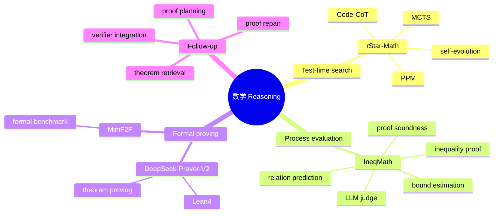

# 数学 Reasoning 思维导图

```mermaid
mindmap
  root((数学 Reasoning))
    Test-time search
      rStar-Math
        MCTS
        Code-CoT
        PPM
        self-evolution
    Process evaluation
      IneqMath
        inequality proof
        bound estimation
        relation prediction
        LLM judge
        proof soundness
    Formal proving
      DeepSeek-Prover-V2
        Lean4
        theorem proving
      MiniF2F
        formal benchmark
    Follow-up
      proof planning
      proof repair
      verifier integration
      theorem retrieval
```
